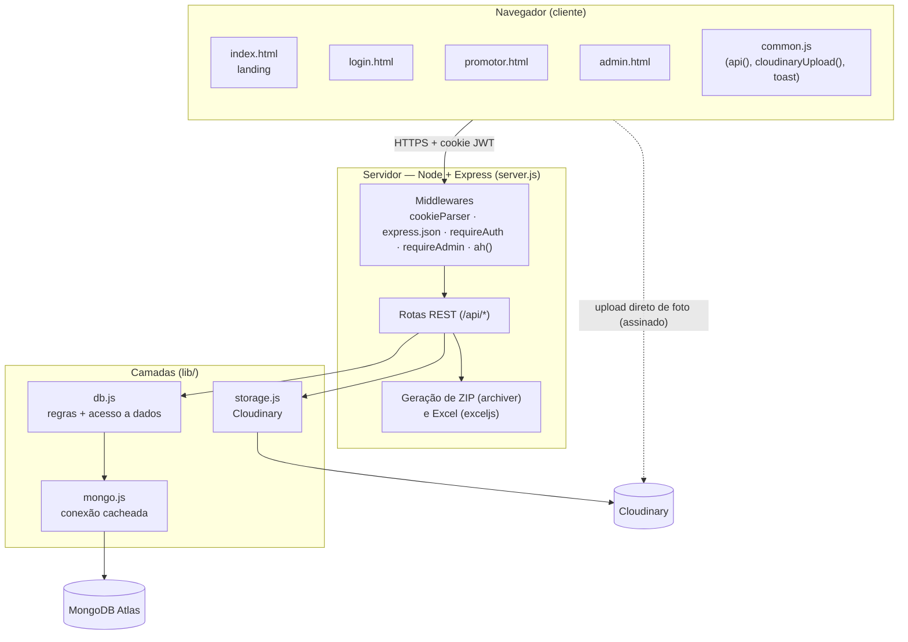
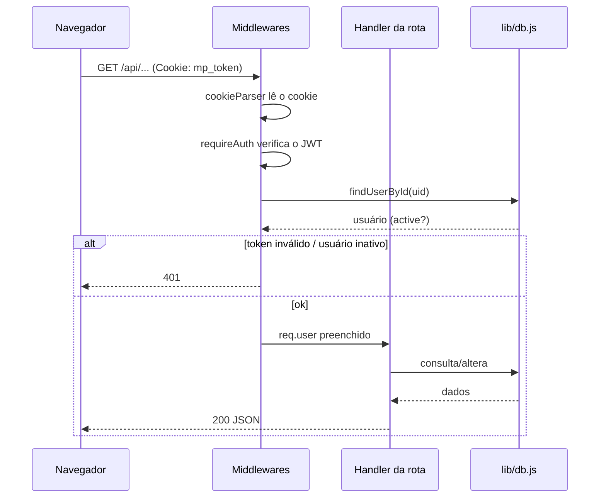

# 01 — Arquitetura

## Visão de componentes



## Stack

| Camada | Tecnologia | Arquivo(s) |
|--------|-----------|-----------|
| Frontend | HTML + CSS + JS puro (sem framework, sem build) | `public/` |
| Servidor | Node.js + Express | `server.js` |
| Autenticação | JWT (`jsonwebtoken`) + cookie httpOnly (`cookie-parser`) | `server.js` |
| Banco de dados | MongoDB Atlas (driver `mongodb`) | `lib/db.js`, `lib/mongo.js` |
| Armazenamento de arquivos | Cloudinary (`cloudinary`) | `lib/storage.js` |
| Exportações | `archiver` (ZIP), `exceljs` (XLSX) | `server.js` |
| Config/segredos | `dotenv` (`.env`, fora do Git) | `.env` |

## Estrutura de pastas

```
TRABALHO/
├─ server.js              Aplicação Express: rotas, auth, ZIP, Excel
├─ lib/
│  ├─ db.js               Regras de negócio + acesso ao MongoDB (assíncrono)
│  ├─ mongo.js            Conexão única e cacheada com o Mongo
│  ├─ storage.js          Cloudinary: upload assinado, URL de entrega, remoção
│  └─ cities.js           Lista de cidades (datalist)
├─ public/
│  ├─ index.html          Landing page (marketing interno)
│  ├─ login.html          Identificação
│  ├─ promotor.html       Envio de fotos + acompanhamento
│  ├─ admin.html          Painel da equipe
│  ├─ common.js           Helpers compartilhados (fetch, upload, toast)
│  └─ style.css           Tema Memphis (claro, teal)
├─ data/
│  └─ seed.json           Dados reais (promotores/grupos/clientes) p/ semear o Mongo
├─ test/
│  └─ smoke.js            Teste de regressão end-to-end (25 casos)
├─ tools/
│  └─ importar-planilhas.js  Reimporta dados das planilhas .xlsx/.xlsm
└─ .env                   Segredos (MONGODB_URI, CLOUDINARY_*, SESSION_SECRET)
```

## Princípios de arquitetura

1. **Separação por camadas.** As rotas (`server.js`) não falam com o Mongo nem com o
   Cloudinary diretamente — sempre via `lib/db.js` e `lib/storage.js`. Isso permitiu
   trocar o backend (de arquivo JSON → MongoDB, de disco → Cloudinary) sem reescrever as rotas.

2. **Serverless-ready.** A aplicação não guarda estado em memória:
   - Sessão → **JWT** (o "crachá" viaja no cookie, não na RAM do servidor).
   - Arquivos → **Cloudinary** (não há disco local).
   - Conexão Mongo **cacheada** entre invocações (`global.__mongoClientPromise`).

3. **O servidor não recebe arquivos.** A foto vai do **navegador direto pro Cloudinary**
   (upload assinado). O servidor só emite a assinatura e registra os metadados. Isso
   contorna o limite de corpo das funções serverless e tira o servidor do caminho do upload.

## Ciclo de uma requisição autenticada



Toda rota assíncrona é embrulhada por `ah()`, que captura erros e os encaminha
para um middleware de erro central (responde JSON, sem vazar stack trace).
