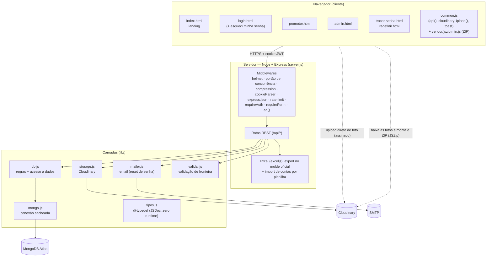
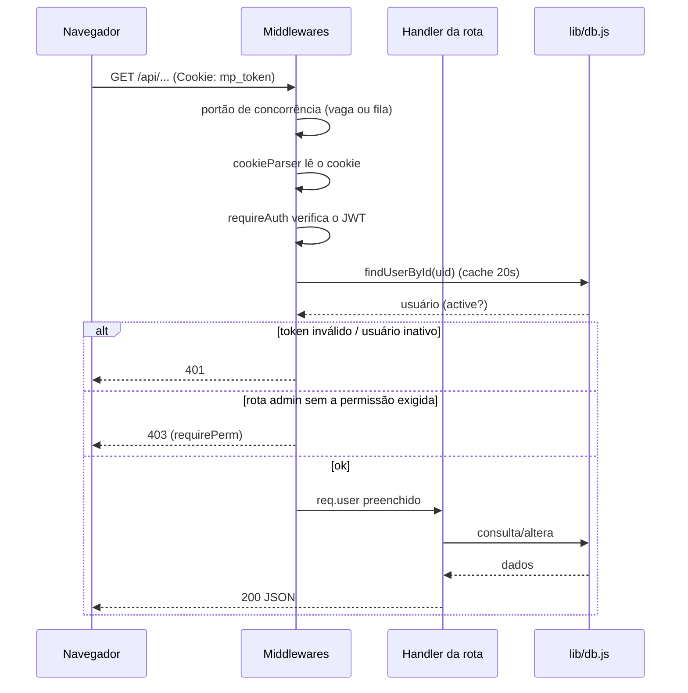

# 01 — Arquitetura

## Visão de componentes



## Stack

| Camada | Tecnologia | Arquivo(s) |
|--------|-----------|-----------|
| Frontend | HTML + CSS + JS puro (sem framework, sem build) | `public/` |
| Servidor | Node.js + Express | `server.js` |
| Autenticação | JWT (`jsonwebtoken`) + cookie httpOnly (`cookie-parser`) | `server.js` |
| Segurança HTTP | `helmet` (CSP) + `express-rate-limit` (login/reset) | `server.js` |
| Banco de dados | MongoDB Atlas (driver `mongodb`) | `lib/db.js`, `lib/mongo.js` |
| Armazenamento de arquivos | Cloudinary (`cloudinary`) | `lib/storage.js` |
| Email (reset de senha) | `nodemailer` | `lib/mailer.js` |
| Excel (export + import de contas) | `exceljs` | `server.js` |
| ZIP | **JSZip no navegador** (vendorado — o servidor só entrega o manifesto) | `public/vendor/jszip.min.js` |
| Compressão | `compression` (gzip) + buffer pré-gzipado da `/api/reference` | `server.js` |
| Config/segredos | `dotenv` (`.env`, fora do Git) | `.env` |
| Validação de entrada | próprio, sem dependência (`req.body` / `req.query`) | `lib/validar.js` |
| Tipagem | JSDoc + `checkJs` — **sem build e sem dependência em produção** | `lib/tipos.js`, `jsconfig.json` |

## Estrutura de pastas

```
TRABALHO/
├─ server.js              Aplicação Express: rotas, auth, permissões, retenção, Excel
├─ api/index.js           Entrypoint serverless (Vercel) — importa o app
├─ discloud.config        Config do host Node persistente (Discloud) — alvo de produção
├─ lib/
│  ├─ db.js               Regras de negócio + acesso ao MongoDB (assíncrono)
│  ├─ mongo.js            Conexão única e cacheada com o Mongo
│  ├─ storage.js          Cloudinary: upload assinado, URL de entrega e URL que expira
│  ├─ mailer.js           Envio de email (redefinição de senha e convite de acesso)
│  ├─ validar.js          Validação de fronteira: recusa operador do Mongo, corta mass assignment
│  ├─ tipos.js            @typedef JSDoc dos contratos centrais (zero runtime, só editor)
│  └─ cities.js           Lista de cidades (datalist)
├─ public/                        ← servido na raiz; o hub vale para todos os módulos
│  ├─ index.html                  Hub dos módulos (PDV ativo; PDP e RCA "em breve")
│  ├─ 404.html                    Página de erro própria
│  ├─ politica-de-privacidade.html  Política pública (legível ANTES do login)
│  ├─ robots.txt                  Disallow: / — ferramenta interna, não indexável
│  ├─ common.js                   Helpers compartilhados (fetch, upload, toast, esc)
│  ├─ style.css                   Tema Memphis (claro, teal)
│  ├─ vendor/jszip.min.js         ZIP montado no navegador
│  ├─ pdv/                        ← módulo da Campanha de PDV
│  │  ├─ index.html               Capa do módulo
│  │  ├─ login.html               Identificação + "esqueci minha senha"
│  │  ├─ cadastro.html            Cadastro público (com aceite da política)
│  │  ├─ promotor.html            Envio de fotos + acompanhamento
│  │  ├─ admin.html               Painel da equipe (abas por permissão)
│  │  ├─ ranking.html             Pódios por edição (quadro de honra)
│  │  ├─ aceitar-politica.html    Portão de aceite da LGPD
│  │  ├─ trocar-senha.html        Troca obrigatória da senha provisória
│  │  └─ redefinir.html           Redefinir senha E criar a primeira (modo convite)
│  ├─ pdp/                        Pesquisa de Preço — em breve (pasta vazia)
│  └─ rca/                        RCA — em breve (pasta vazia)
├─ data/
│  └─ seed.json           Dados reais (promotores/grupos/clientes) p/ semear o Mongo
├─ docs/
│  ├─ 01..09-*.md         Esta documentação
│  ├─ bpmn/*.bpmn         Processos em BPMN 2.0 — artefato NORMATIVO
│  └─ PLANO.md            Plano de trabalho da reformulação (temporal)
├─ test/
│  ├─ smoke.js            Regressão end-to-end (~147 verificações)
│  ├─ pentest.js          Pentest do próprio app (49 verificações)
│  ├─ lgpd-portao.js      Portão do aceite (sobe servidor com LGPD_BLOQUEIA=1)
│  ├─ retencao.js         Retenção e anonimização (envelhece fotos na marra)
│  ├─ reset.js            Reset destrutivo, incl. o abort quando o backup falha
│  └─ carga.js            Teste de carga (até 5.000 usuários simultâneos)
├─ tools/
│  ├─ importar-planilhas.js  Gera o seed.json das planilhas .xlsx/.xlsm
│  ├─ criar-promotores.js    Cria contas em massa via CLI
│  ├─ seed-teste.js          Popula o banco de teste com carga realista
│  ├─ limpar-orfas.js        Remove imagens órfãs no Cloudinary
│  └─ dev-preview.js         Sobe o servidor local sempre no banco de TESTE
```

## Princípios de arquitetura

1. **Separação por camadas.** As rotas (`server.js`) não falam com o Mongo nem com o
   Cloudinary diretamente — sempre via `lib/db.js` e `lib/storage.js`. Isso permitiu
   trocar o backend (de arquivo JSON → MongoDB, de disco → Cloudinary) sem reescrever as rotas.

2. **Serverless-ready.** A aplicação não guarda estado obrigatório em memória:
   - Sessão → **JWT** (o token viaja no cookie, não na RAM do servidor).
   - Arquivos → **Cloudinary** (não há disco local).
   - Conexão Mongo **cacheada** entre invocações (`global.__mongoClientPromise`).
   - Os caches em memória (usuário, referência, config) são só **aceleradores efêmeros** —
     podem sumir a qualquer momento sem quebrar nada.

3. **O trabalho pesado fica fora do servidor.**
   - A foto vai do **navegador direto pro Cloudinary** (upload assinado) — o servidor só
     emite a assinatura e registra os metadados.
   - O **ZIP é montado no navegador** (JSZip): o servidor entrega um manifesto com URLs
     assinadas e recebe a confirmação depois. Sem timeout de função, sem RAM estourada.

4. **Aguenta rajada (~1.4k promotores).** Medido com `test/carga.js` (5.000 simultâneos):
   - **Portão de concorrência**: no máximo 300 requisições de API ao mesmo tempo;
     as demais esperam numa fila leve (até 8.000) e acima disso recebem **503** educado —
     degradar com aviso é melhor que derrubar o servidor pra todo mundo.
   - `/api/reference` (maior payload — o banco de promotores inteiro) é servida de um
     **buffer único pré-gzipado**, compartilhado por todas as respostas.
   - Cache de usuário no `requireAuth` (20s), cache + *single-flight* da referência/config,
     pool do Mongo em 100 conexões, `bcrypt` **assíncrono** no login (não trava o event loop).
   - Teto prático: o Atlas **M0 grátis** (~60 req/s sustentado) — ver [08 — Deploy](08-deploy.md).

## Ciclo de uma requisição autenticada



Toda rota assíncrona é embrulhada por `ah()`, que captura erros e os encaminha
para um middleware de erro central (responde JSON, sem vazar stack trace).
