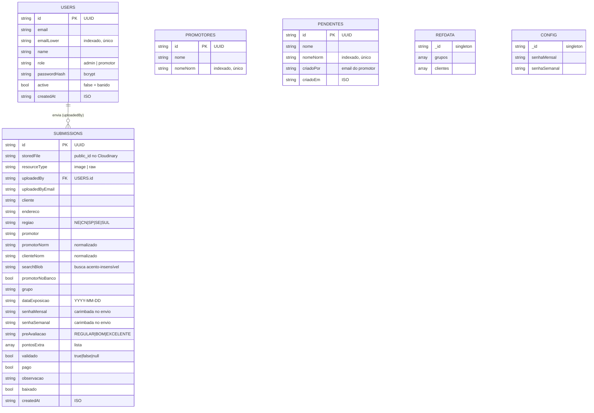

# 02 — Modelo de Dados (MongoDB)

Banco: **MongoDB Atlas**, base `memphis_pdv` (configurável via `MONGO_DB`).
Cada documento usa um campo **`id`** (UUID) como chave lógica — não o `_id` do Mongo —
para manter as URLs e o frontend estáveis.

## Diagrama Entidade-Relacionamento

## Coleções

### `users`
Contas de acesso (admins e promotores).
- `role`: `admin` (acessa o painel) ou `promotor` (só envia).
- `active`: `false` = **banido** (login e requisições bloqueados).
- Senha guardada como **hash bcrypt** — nunca em texto.

### `submissions`
Cada **foto** enviada é um documento.
- `storedFile` + `resourceType`: referência ao arquivo no Cloudinary (a foto não fica no Mongo).
- Campos `*Norm` e `searchBlob`: versões normalizadas (minúsculo, sem acento) para
  busca e checagem rápidas.
- `senhaMensal` / `senhaSemanal`: **carimbadas pelo servidor** no momento do envio
  (vêm de `config`, não são digitadas pelo promotor — anti-fraude).
- Flags de avaliação (`preAvaliacao`, `pontosExtra`, `validado`, `pago`) são **independentes**
  entre si — ver ciclo de vida em [04 — Fluxos](04-fluxos-bpmn.md).

### `promotores`
Banco oficial de nomes de promotores da empresa (~2.050). Usado para **checar** se quem
envia existe no cadastro. Índice único em `nomeNorm` para lookup e autocomplete rápidos.

### `pendentes`
Nomes que promotores cadastraram por não estarem no banco — aguardam **aprovação** da equipe.
Ao aprovar, o nome migra para `promotores` e o pendente é removido.

### `refdata` (documento único `singleton`)
Listas editáveis: `grupos` e `clientes` (usadas em autocomplete e filtros).

### `config` (documento único `singleton`)
`senhaMensal` e `senhaSemanal` **atuais**, definidas pela equipe. São o "codinome" da
campanha que o promotor vê na hora de enviar.

## Índices (criados em `db.init()`)

| Coleção | Índice | Tipo |
|---------|--------|------|
| `users` | `emailLower` | único |
| `promotores` | `nomeNorm` | único |
| `pendentes` | `nomeNorm` | único |
| `submissions` | `id` | único |
| `submissions` | `regiao` | simples |
| `submissions` | `baixado` | simples |
| `submissions` | `searchBlob` | simples |
| `submissions` | `createdAt` | descendente |

## Seed inicial

No primeiro boot (`db.init()`), se as coleções estiverem vazias:
- cria o admin `admin@local` / `admin123` (trocar após o primeiro acesso);
- semeia `promotores`, `refdata.grupos` e `refdata.clientes` a partir de `data/seed.json`;
- cria `config` com senhas padrão.

`data/seed.json` é gerado por `tools/importar-planilhas.js` a partir das planilhas
internas (`Registro de clientes…`, `Cadastro Promotores…`).
