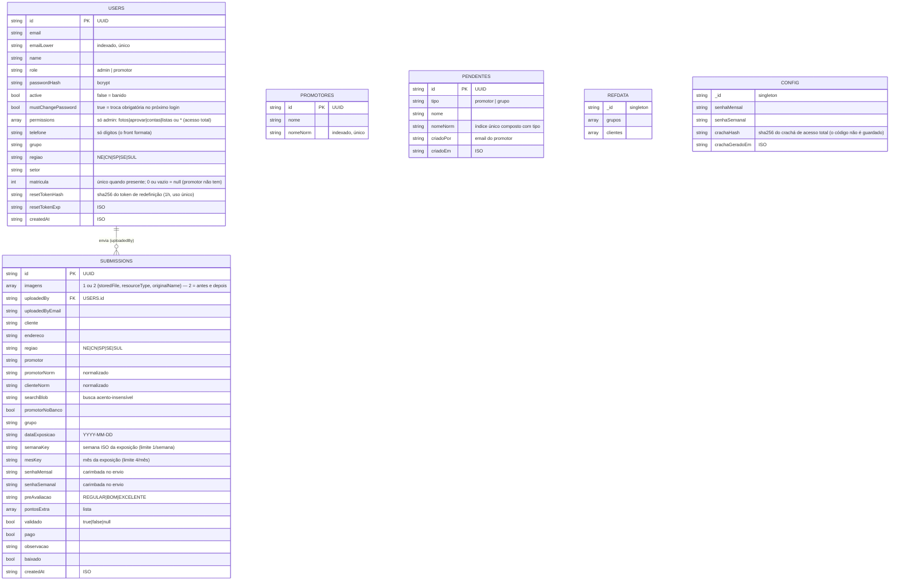

# 02 — Modelo de Dados (MongoDB)

Banco: **MongoDB Atlas**, base `memphis_pdv` (configurável via `MONGO_DB`).
Cada documento usa um campo **`id`** (UUID) como chave lógica — não o `_id` do Mongo —
para manter as URLs e o frontend estáveis.

## Diagrama Entidade-Relacionamento

## Coleções

### `users`
Contas de acesso (admins e promotores).
- `role`: `admin` (acessa o painel) ou `promotor` (só envia).
- `active`: `false` = **banido** (login e requisições bloqueados).
- `mustChangePassword`: senha **provisória** — o front força a troca no primeiro login
  (`trocar-senha.html`). Setada ao criar conta em massa, ao importar por planilha e
  quando o admin redefine a senha de alguém.
- `permissions` (só admin): lista granular — `fotos`, `aprovar`, `contas`, `listas`, `aderencia` —
  ou `['*']` (**acesso total**, obtido validando o crachá). Admin novo nasce **sem
  nenhuma** permissão, a menos que quem criou tenha acesso total.
- Perfil: `telefone` (só dígitos), `grupo`, `regiao`, `setor`, `matricula`
  (inteiro **único** entre as contas, ou `null`; **`0` também vale como "sem matrícula"** —
  promotor não tem — e vira `null`, sem travar duplicado).
- `aceiteVersao` / `aceiteEm`: **aceite da política de privacidade** — a versão aceita
  (ex.: `'2026-08'`) e quando. Guardar a *versão*, e não um booleano, é o que faz uma
  política nova pedir aceite de novo. Conta do cadastro público já nasce com o aceite;
  conta criada por importação nasce **sem**, e cai no portão do `requireAuth`.
- Senha guardada como **hash bcrypt** — nunca em texto. Tokens de redefinição também
  só como hash (`resetTokenHash`, expira em 1h, uso único).

### `submissions`
Cada **foto** enviada é um documento — e uma foto pode ter **1 ou 2 imagens**
(`imagens[]`; 2 = "antes e depois"), mas conta como **1** para os limites.
- `imagens[].storedFile` + `resourceType`: referência ao arquivo no Cloudinary
  (a foto não fica no Mongo). Registros antigos com `storedFile` único ainda são lidos
  (fallback em `server.js`).
- `semanaKey` / `mesKey`: chaves da **data de exposição**, usadas nas travas de
  **1 foto/semana** e **4 fotos/mês** por promotor.
- Campos `*Norm` e `searchBlob`: versões normalizadas (minúsculo, sem acento) para
  busca e checagem rápidas.
- `senhaMensal` / `senhaSemanal`: **carimbadas pelo servidor** no momento do envio
  (vêm de `config`, não são digitadas pelo promotor — anti-fraude).
- Flags de avaliação (`preAvaliacao`, `pontosExtra`, `validado`, `pago`) são **independentes**
  entre si — ver ciclo de vida em [04 — Fluxos](04-fluxos-bpmn.md).

### `promotores`
Banco oficial de nomes de promotores da empresa (~2.050). Usado para **checar** se quem
envia existe no cadastro. Índice único em `nomeNorm` para lookup e autocomplete rápidos.

### `pendentes`
Nomes que aguardam **aprovação** da equipe — agora de dois tipos: `promotor`
(cadastrado pelo promotor no envio) e `grupo` (grupo digitado que não está na lista
oficial entra na fila automaticamente). Ao aprovar, o nome migra para `promotores`
ou `refdata.grupos` conforme o tipo.

### `refdata` (documento único `singleton`)
Listas editáveis: `grupos` e `clientes` (usadas em autocomplete e filtros).

### `config` (documento único `singleton`)
- `senhaMensal` / `senhaSemanal` **atuais**, definidas pela equipe — o "codinome" da
  campanha que o promotor vê na hora de enviar.
- `crachaHash`: sha256 do **crachá de acesso total** vigente. O código em si aparece
  uma única vez pra quem gerou; gerar um novo substitui o hash (invalida o anterior).
- **Dados institucionais da LGPD**, editáveis na aba Listas e servidos publicamente por
  `GET /api/contato` (a política precisa ser legível antes do login):
  `encarregadoEmail`, `contatoTelefone`, `politicaVersao` e `avisoTransicaoWhatsapp`
  (permissão `listas`); `razaoSocial`, `cnpj` e `enderecoMatriz` (**acesso total**).
  Ficam aqui, e não no `.env`, porque no Discloud mexer no `.env` exige painel + restart +
  acesso do dono — e o encarregado precisa ser trocável por quem assumir depois.
  Campo ausente cai num padrão embutido, então o sistema nunca fica sem contato.

### `auditoria`
Registro de **acesso a dado pessoal** (LGPD, Art. 37). Guarda **só evento sensível** —
auditar toda requisição viraria o gargalo do Atlas M0 e afogaria o que importa em ruído.
- Campos: `ts` (Date), `userId`, `userNome`, `userEmail`, `acao`, `alvo`, `qtd`, `ip`, `detalhe`.
- Ações registradas: baixou ZIP, exportou Excel, excluiu foto, purgou lote, criou/editou/
  baniu/reativou/excluiu conta, trocou senha de terceiro, importou contas, importou listas,
  gerou crachá, usou crachá.
- **Índice TTL de 12 meses** — some sozinha. Aqui o TTL *serve*, ao contrário da retenção de
  fotos: apagar um registro de auditoria não deixa arquivo órfão no Cloudinary, é só texto.
- Leitura em `GET /api/admin/auditoria`, restrita a **acesso total** — é a trilha de quem
  acessou o quê; abri-la a qualquer admin daria a cada um o rastro de todos os outros.
- Gravar **nunca derruba a operação**: se o Mongo falhar no registro, a foto ainda é baixada.
  O motivo de existir: `baixado = true` diz que a foto saiu, mas não diz **quem** a levou —
  que é exatamente a pergunta de uma auditoria.

## Índices (criados em `db.init()`)

| Coleção | Índice | Tipo |
|---------|--------|------|
| `users` | `emailLower` | único |
| `promotores` | `nomeNorm` | único |
| `pendentes` | `tipo + nomeNorm` | único composto |
| `submissions` | `id` | único |
| `submissions` | `regiao` | simples |
| `submissions` | `baixado` | simples |
| `submissions` | `searchBlob` | simples |
| `submissions` | `createdAt` | descendente |
| `auditoria` | `ts` | **TTL 12 meses** |
| `auditoria` | `ts` desc / `userId` | consulta da tela |

## Seed inicial

No primeiro boot (`db.init()`), se as coleções estiverem vazias:
- cria o primeiro admin com `permissions: ['*']`: e-mail de `ADMIN_EMAIL` (padrão
  `admin@local`) e senha de `ADMIN_SENHA` — sem a env, a senha é **sorteada**, aparece
  uma única vez no log e a troca é obrigatória no 1º login (nada de senha fixa no código);
- semeia `promotores`, `refdata.grupos` e `refdata.clientes` a partir de `data/seed.json`;
- cria `config` com senhas padrão;
- migra dados antigos (pendentes sem `tipo` viram `promotor`).

`data/seed.json` é gerado por `tools/importar-planilhas.js` a partir das planilhas
internas (`Registro de clientes…`, `Cadastro Promotores…`). Contas de promotor em massa
podem ser criadas pelo painel (**Criar por planilha**) ou por `tools/criar-promotores.js`.
