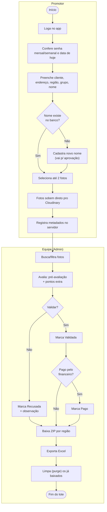
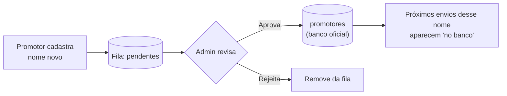
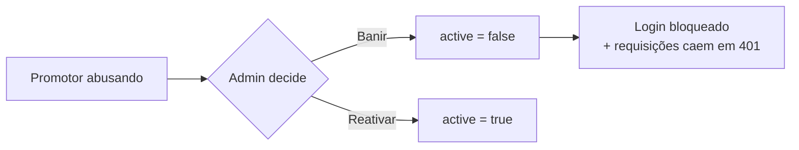
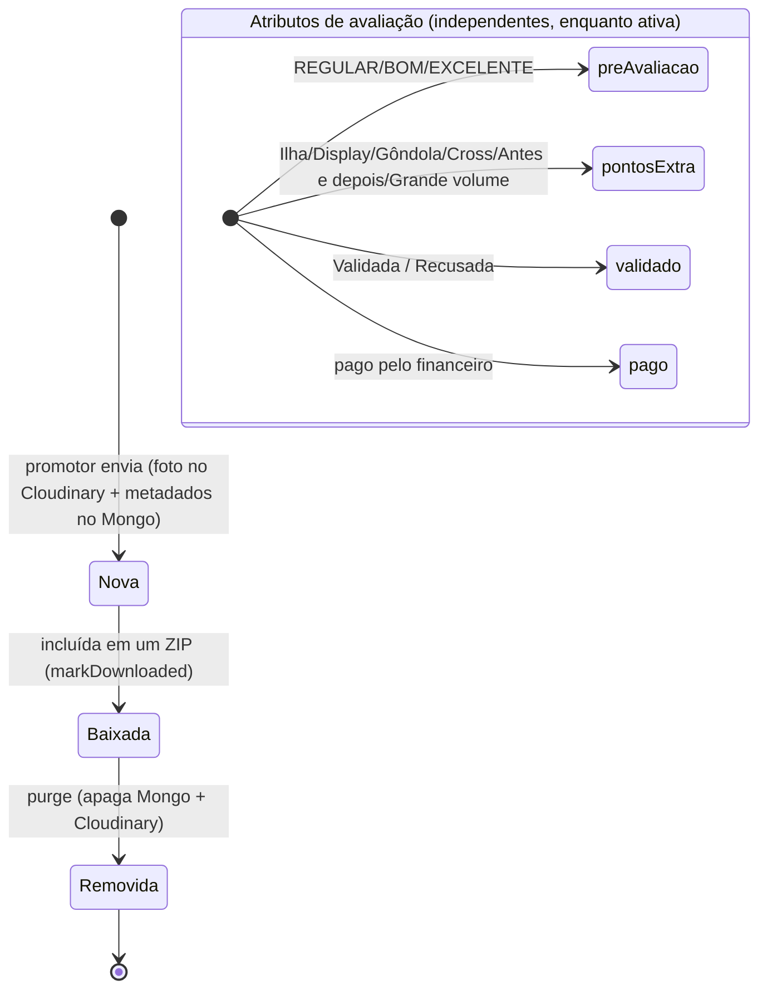

# 04 — Fluxos de Negócio (BPMN)

## Processo ponta-a-ponta

Da foto no campo ao relatório, com as raias dos dois papéis e dos sistemas externos.

## Subprocesso: aprovação de promotor novo

## Subprocesso: moderação de promotor (banir)

## Ciclo de vida da submissão (foto)

O **armazenamento** segue um caminho sequencial (Nova → Baixada → Removida).
As **avaliações** são atributos independentes aplicados enquanto a foto está ativa.

> **Importante:** `validado`, `pago`, `preAvaliacao` e `pontosExtra` são flags
> **independentes** — uma foto pode estar "validada" sem estar "paga", "paga" sem
> "baixada", etc. O único estado sequencial real é `baixado` → `purge`.

## Regras de negócio principais

| Regra | Onde | Detalhe |
|-------|------|---------|
| Máximo **2 fotos por cliente** | `/api/submissions` | Conta o que o promotor já enviou pra aquele cliente (`countByPromotorCliente`). |
| Senhas **carimbadas pelo servidor** | `/api/submissions` | Vêm de `config` no momento do envio — o promotor não digita. |
| Checagem de promotor | `/api/check-promotor` | Compara nome normalizado (sem acento/maiúsculas) com o banco oficial. |
| Grupo é do **promotor** | envio | A equipe não edita grupo (decisão de negócio). |
| Baixar **não apaga** | `/api/admin/download` | Só marca `baixado=true`. A remoção é uma ação separada e explícita (`purge`). |
| Foto **recusada não é baixada** | `/api/admin/download-manifest` | `validado === false` fica de fora do ZIP. Ao validar, volta a ser baixável. |
| Pasta do ZIP = "COLAR EM PASTAS" | `/api/admin/download` | `Região / "REF - Cliente - Promotor"`, espelhando o servidor interno. |
| Admin é protegido | `setUserActive` / `deleteUser` | Não pode ser banido nem excluído. |
