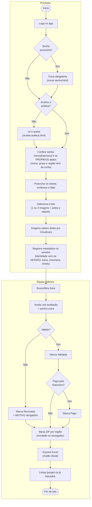
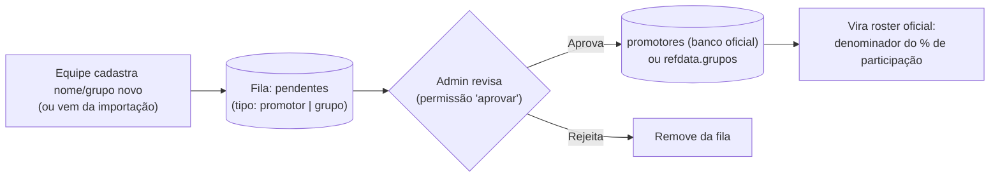
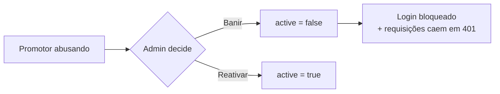
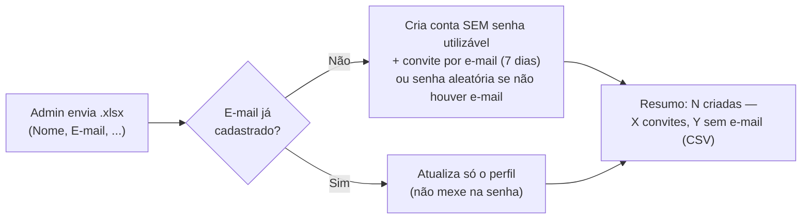
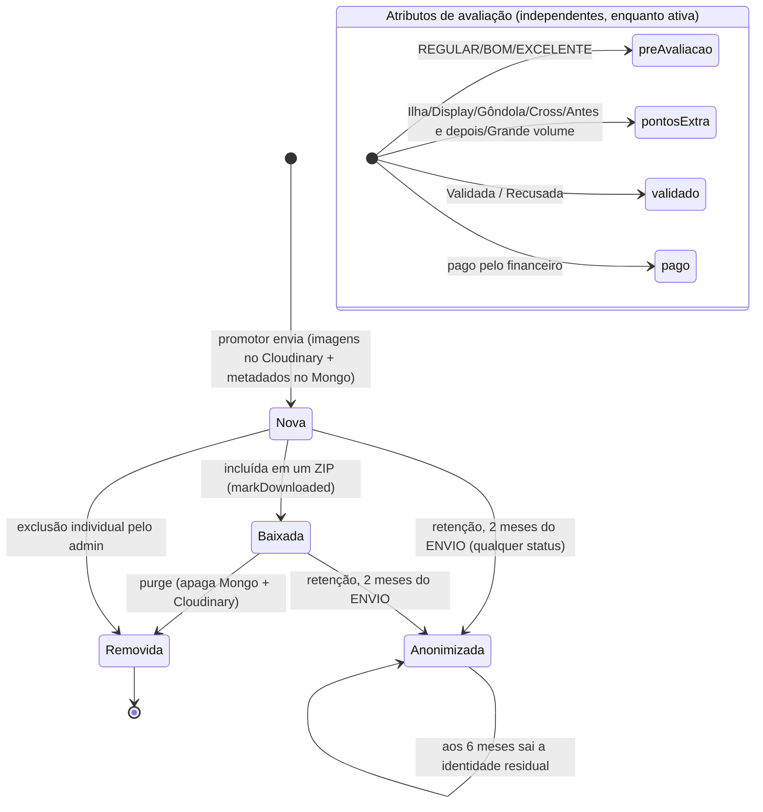

# 04 — Fluxos de Negócio (BPMN)

> **Artefatos normativos:** os processos existem em BPMN 2.0 de verdade em
> [`docs/bpmn/`](bpmn/) (Camunda Modeler / bpmn.io). Em divergência com o Mermaid
> desta página, **vale o `.bpmn`**.
>
> | Arquivo | Processo |
> |---|---|
> | [01-envio-e-avaliacao](bpmn/01-envio-e-avaliacao.bpmn) | Ponta a ponta: pool Promotor, pool Equipe, Cloudinary/Mongo como black-box |
> | [02-cadastro-e-aprovacao](bpmn/02-cadastro-e-aprovacao.bpmn) | Sign up → fila de pendentes → aprovação de conta, promotor e grupo |
> | [03-onboarding-de-contas](bpmn/03-onboarding-de-contas.bpmn) | Importação → convite por e-mail / provisória → 1º acesso → aceite. Subprocesso: reset + backup |
> | [04-fechamento-do-lote](bpmn/04-fechamento-do-lote.bpmn) | ZIP → Excel → marcar baixado → purge |
> | [05-retencao-e-anonimizacao](bpmn/05-retencao-e-anonimizacao.bpmn) | Os três relógios: escalonamento 30/45/53 → imagem aos 2 meses → identidade aos 6 |
> | [06-direitos-do-titular](bpmn/06-direitos-do-titular.bpmn) | Solicitação → identificação → exportar ou anonimizar → resposta |
>
> Os `.bpmn` de **03**, **05** e **06** desenham o processo-**alvo** do plano LGPD
> (`docs/PLANO.md`), que ainda está sendo implementado — os demais espelham o que já roda.

## Processo ponta-a-ponta

Da foto no campo ao relatório, com as raias dos dois papéis e dos sistemas externos.

## Subprocesso: aprovação de promotor e grupo novos

A fila de pendentes tem **dois tipos**: nomes de promotor e **grupos**.

> ⚠️ **Mudou no Bloco 2.** Antes a fila nascia do **envio do promotor** (ele digitava um
> nome ou um grupo que não existia). Hoje ele não digita nem um nem outro — a fila é
> alimentada pela **equipe** e pela **importação**, e `POST /api/promotor-pendente` exige
> permissão `listas`.

## Subprocesso: moderação de promotor (banir)

## Subprocesso: contas em massa por planilha

## Ciclo de vida da submissão (foto)

O **armazenamento** segue um caminho sequencial (Nova → Baixada → Removida).
As **avaliações** são atributos independentes aplicados enquanto a foto está ativa.

> **Importante:** `validado`, `pago`, `preAvaliacao` e `pontosExtra` são flags
> **independentes** — uma foto pode estar "validada" sem estar "paga", "paga" sem
> "baixada", etc. O único estado sequencial real é `baixado` → `purge`.
>
> **Anonimizada** é estado terminal do ponto de vista do dado pessoal: a imagem foi
> apagada e o documento continua, sem identidade, alimentando os gráficos. Detalhe em
> [09 — LGPD](09-lgpd.md).

## Regras de negócio principais

| Regra | Onde | Detalhe |
|-------|------|---------|
| **1 foto/semana e 4 fotos/mês** por promotor | `/api/submissions` | Contadas pela **data da exposição** (`semanaKey`/`mesKey`), não pela data do envio. **Foto recusada não consome cota** — na prática é como se não tivesse mandado nada; pendente **conta**. Efeito prático: recusar **devolve a vaga na hora**. |
| 1 foto = até **2 imagens** ("antes e depois") | `/api/submissions` | As 2 imagens contam como **1 foto** nos limites. |
| Senhas **carimbadas pelo servidor** | `/api/submissions` | Vêm de `config` no momento do envio — o promotor não digita. |
| Checagem de promotor | `/api/check-promotor` | Compara nome normalizado (sem acento/maiúsculas) com o roster oficial. **Só admin** desde o Bloco 2 — o promotor não digita mais o próprio nome. |
| **Identidade vem da sessão** | `/api/submissions` | ⚠️ **Regra invertida no Bloco 2.** Antes o promotor digitava nome, grupo e região; agora os três vêm da **conta**, e o que vier no corpo é ignorado. Quem edita o cadastro é a equipe — o promotor só abre um **pedido de correção**. A fila de grupos pendentes saiu do fluxo dele. |
| Fonte da verdade do grupo | aderência | `promotores.grupo` (o roster), não `users.grupo`. Na anonimização ele é **congelado** em `grupoOficial`. |
| Baixar **não apaga** | `mark-downloaded` | Só marca `baixado=true`. A remoção é uma ação separada e explícita (`purge` ou exclusão individual). |
| Foto **recusada não é baixada** | `/api/admin/download-manifest` | `validado === false` fica de fora do ZIP. Ao validar, volta a ser baixável. |
| **Motivo obrigatório ao recusar** | `updateSubmission` | O promotor **vê** o motivo na tela dele; recusar sem um deixaria só "Recusada" sem explicação — que é a queixa que originou a mudança. A lista tem **"Outros"** como escape, então ninguém fica preso no meio de um lote. |
| Pasta do ZIP = "COLAR EM PASTAS" | `/api/admin/download-manifest` | `Região / "REF - Cliente - Promotor"`, espelhando o servidor interno. |
| Primeiro acesso por **convite** | importação → e-mail | Conta com e-mail nasce **sem senha utilizável** e recebe link de 7 dias para criar a própria. Sem e-mail: login interno + **senha aleatória** entregue pelo responsável. Senha nunca é derivada de dado pessoal. |
| Senha provisória exige troca | login → `trocar-senha.html` | Contas criadas manualmente e senhas redefinidas pelo admin nascem com `mustChangePassword`. |
| **Aceite da política** | `requireAuth` | Sem o aceite da versão vigente, a API responde **403 + `precisaAceitar`** (quando `LGPD_BLOQUEIA=1`). Vale para todos, admin inclusive. |
| **Retenção por idade** | rotina diária | 2 meses da **entrada** (`createdAt`), não da exposição. Vale para qualquer status — inclusive recusada e vencedora de ranking. Ver [09 — LGPD](09-lgpd.md). |
| Senha **"0"** = primeiro acesso | login → `trocar-senha.html?primeiro=1` | A pessoa entra com `0` e cai numa tela de **boas-vindas** pra criar a própria senha (sem digitar a provisória). Vale na planilha e na criação manual. |
| Admin é protegido | `setUserActive` / `deleteUser` | Não pode ser banido nem excluído. |
| Permissões granulares no painel | `requirePerm` | Cada aba/ação exige `fotos`/`aprovar`/`contas`/`listas`/`aderencia`; acesso total (`*`) só via crachá. |
