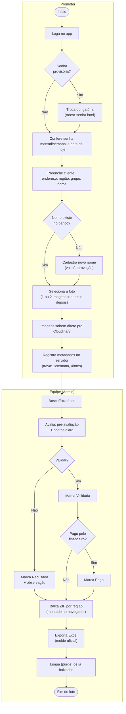
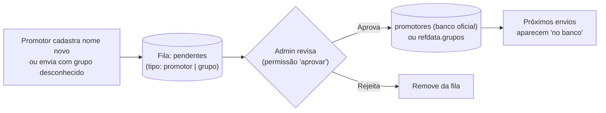
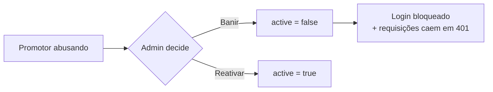
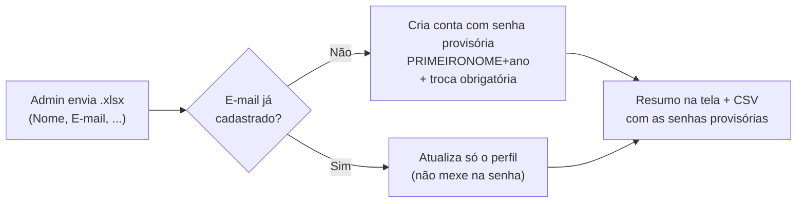
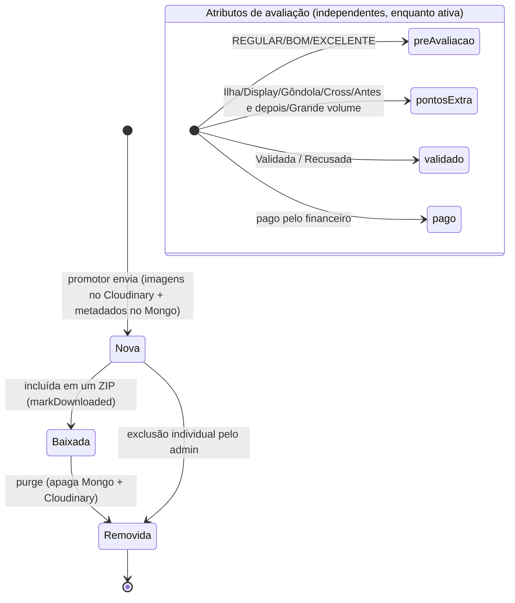

# 04 — Fluxos de Negócio (BPMN)

> **Artefato normativo:** o processo ponta-a-ponta existe em BPMN 2.0 de verdade em
> [`bpmn/01-envio-e-avaliacao.bpmn`](bpmn/01-envio-e-avaliacao.bpmn) (Camunda Modeler /
> bpmn.io). Em divergência com o Mermaid abaixo, **vale o `.bpmn`**.

## Processo ponta-a-ponta

Da foto no campo ao relatório, com as raias dos dois papéis e dos sistemas externos.

## Subprocesso: aprovação de promotor e grupo novos

A fila de pendentes tem **dois tipos**: nomes de promotor (cadastrados pelo promotor
na hora do envio) e **grupos** (um grupo digitado que não está na lista oficial entra
na fila automaticamente junto com o envio).

## Subprocesso: moderação de promotor (banir)

## Subprocesso: contas em massa por planilha

## Ciclo de vida da submissão (foto)

O **armazenamento** segue um caminho sequencial (Nova → Baixada → Removida).
As **avaliações** são atributos independentes aplicados enquanto a foto está ativa.

> **Importante:** `validado`, `pago`, `preAvaliacao` e `pontosExtra` são flags
> **independentes** — uma foto pode estar "validada" sem estar "paga", "paga" sem
> "baixada", etc. O único estado sequencial real é `baixado` → `purge`.

## Regras de negócio principais

| Regra | Onde | Detalhe |
|-------|------|---------|
| **1 foto/semana e 4 fotos/mês** por promotor | `/api/submissions` | Contadas pela **data da exposição** (`semanaKey`/`mesKey`), não pela data do envio. |
| 1 foto = até **2 imagens** ("antes e depois") | `/api/submissions` | As 2 imagens contam como **1 foto** nos limites. |
| Senhas **carimbadas pelo servidor** | `/api/submissions` | Vêm de `config` no momento do envio — o promotor não digita. |
| Checagem de promotor | `/api/check-promotor` | Compara nome normalizado (sem acento/maiúsculas) com o banco oficial. |
| Grupo é do **promotor** | envio | A equipe não edita grupo; grupo novo vai pra fila de aprovação. |
| Baixar **não apaga** | `mark-downloaded` | Só marca `baixado=true`. A remoção é uma ação separada e explícita (`purge` ou exclusão individual). |
| Foto **recusada não é baixada** | `/api/admin/download-manifest` | `validado === false` fica de fora do ZIP. Ao validar, volta a ser baixável. |
| Pasta do ZIP = "COLAR EM PASTAS" | `/api/admin/download-manifest` | `Região / "REF - Cliente - Promotor"`, espelhando o servidor interno. |
| Senha provisória exige troca | login → `trocar-senha.html` | Contas criadas em massa/por planilha e senhas redefinidas pelo admin nascem com `mustChangePassword`. |
| Senha **"0"** = primeiro acesso | login → `trocar-senha.html?primeiro=1` | A pessoa entra com `0` e cai numa tela de **boas-vindas** pra criar a própria senha (sem digitar a provisória). Vale na planilha e na criação manual. |
| Admin é protegido | `setUserActive` / `deleteUser` | Não pode ser banido nem excluído. |
| Permissões granulares no painel | `requirePerm` | Cada aba/ação exige `fotos`/`aprovar`/`contas`/`listas`/`aderencia`; acesso total (`*`) só via crachá. |
