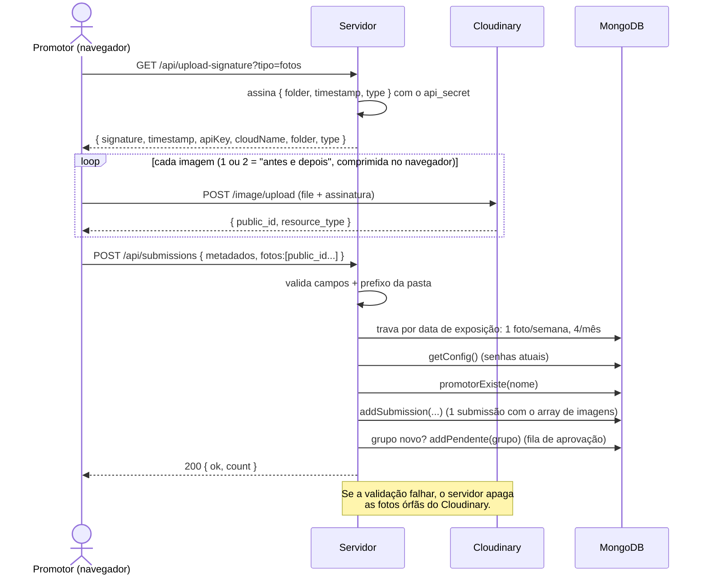
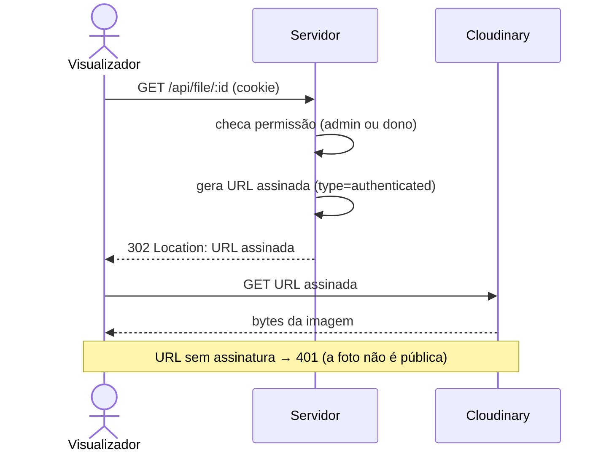
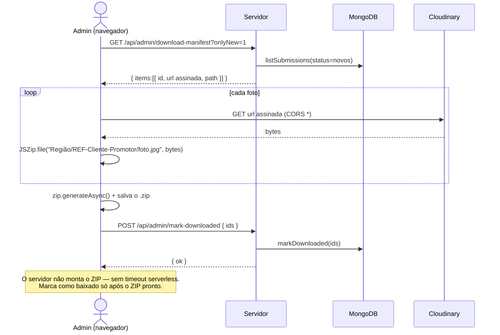
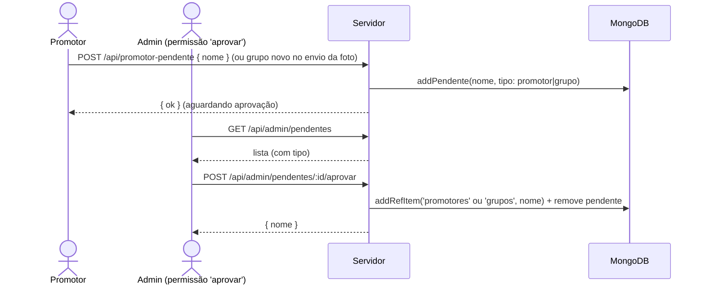
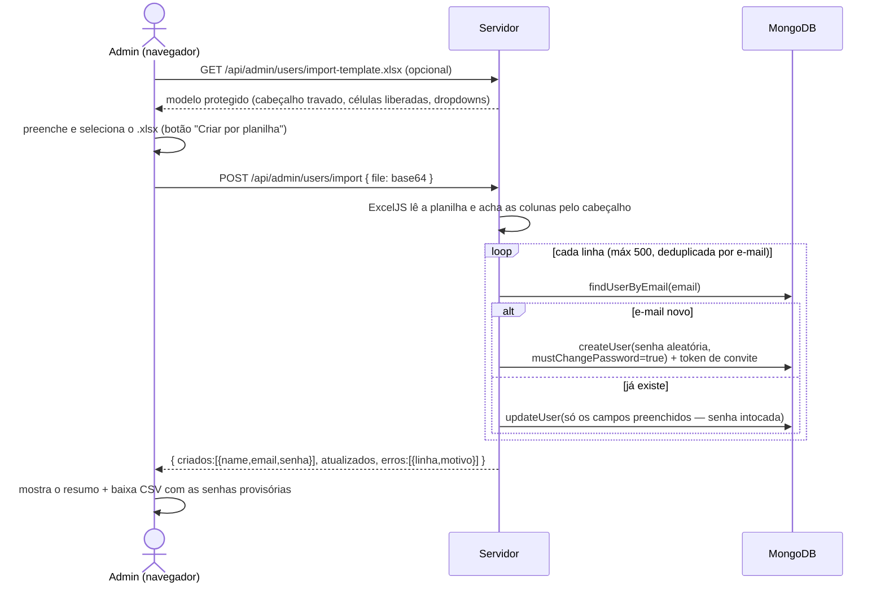

# 05 — Diagramas de Sequência (UML)

## Login (JWT)

```mermaid
sequenceDiagram
  actor U as Usuário
  participant S as Servidor (Express)
  participant DB as MongoDB
  U->>S: POST /api/login { email, senha }
  S->>DB: findUserByEmail(email)
  DB-->>S: usuário { passwordHash, active, role }
  alt inativo ou senha errada
    S-->>U: 401 { error }  (rate-limit: 10 falhas/15min)
  else ok
    S->>S: jwt.sign({ uid, role })
    S-->>U: 200 { role, name, mustChangePassword } + Set-Cookie: mp_token (httpOnly)
  end
  Note over U,S: Se mustChangePassword=true, o front leva pra trocar-senha.html<br/>antes de liberar o app (senha provisória).
  Note over U,S: Requisições seguintes mandam o cookie.<br/>requireAuth verifica o JWT e revalida 'active' no Mongo;<br/>rotas /api/admin/* ainda passam pelo requirePerm (permissão granular).
```

## Envio de foto (upload direto, assinado)



> O arquivo **nunca passa pelo servidor** — vai do navegador direto pro Cloudinary.
> Isso elimina o limite de corpo das funções serverless e descarrega o upload.

## Servir uma foto (entrega autenticada)



## Download em ZIP (montado no navegador)



## Aprovação de promotor / grupo



## Criar contas em massa por planilha


