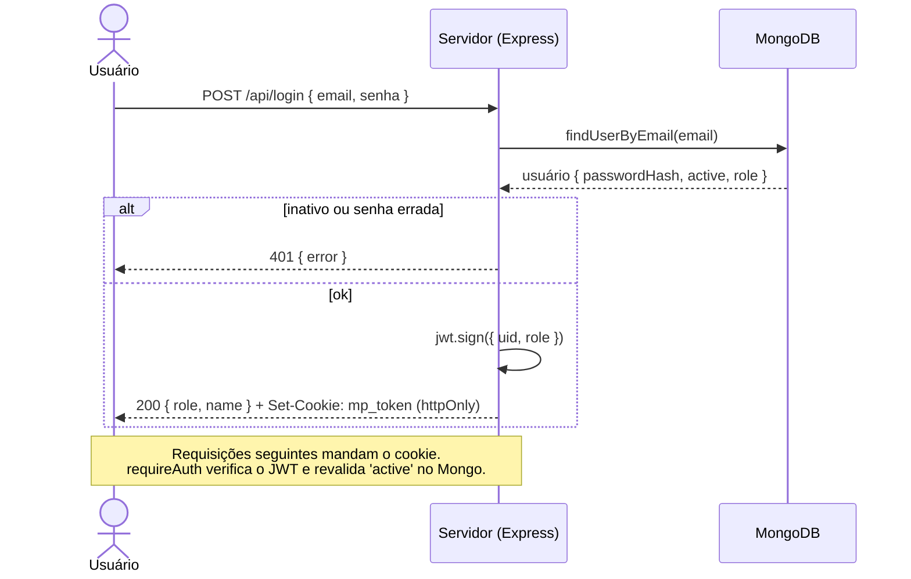
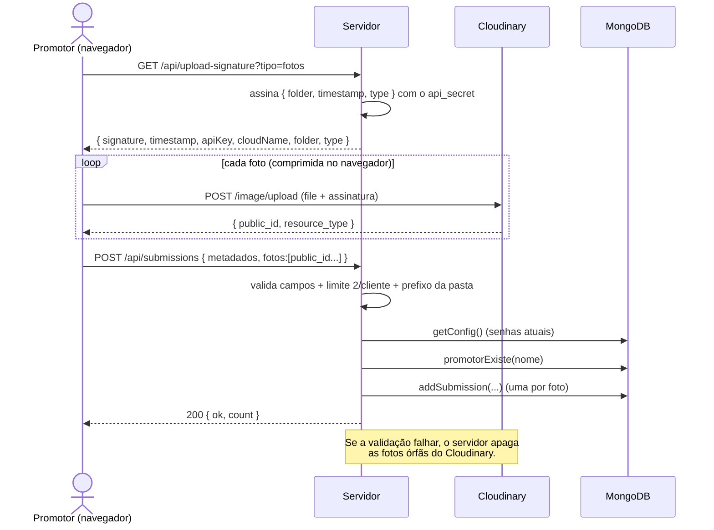
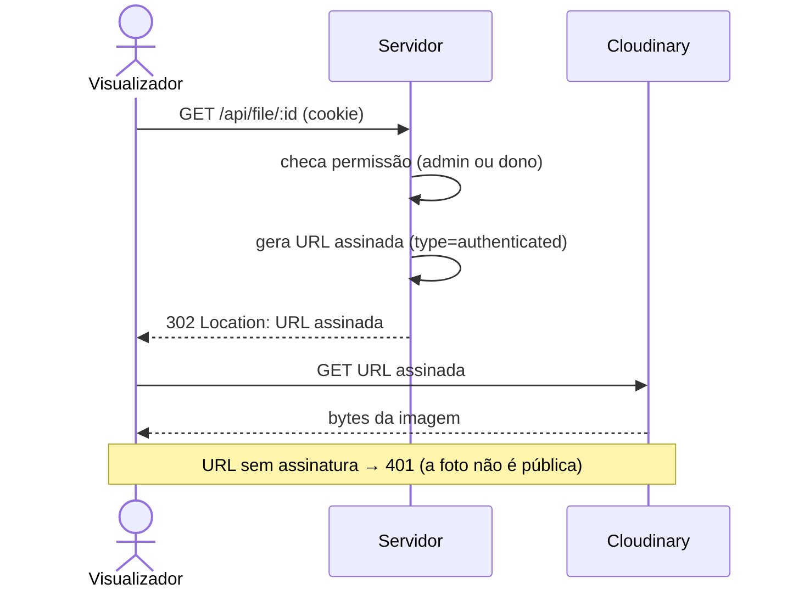
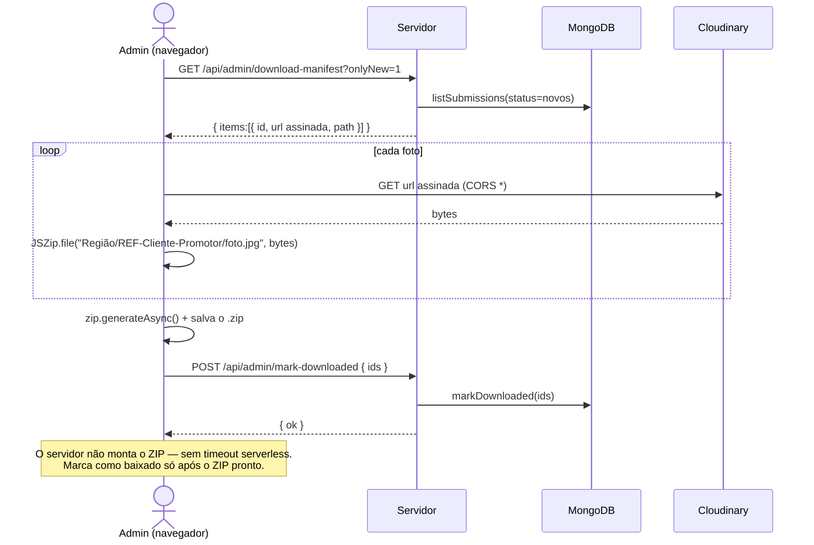
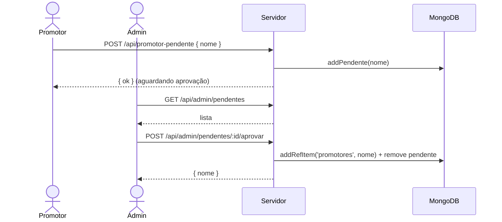

# 05 — Diagramas de Sequência (UML)

## Login (JWT)

## Envio de foto (upload direto, assinado)

> O arquivo **nunca passa pelo servidor** — vai do navegador direto pro Cloudinary.
> Isso elimina o limite de corpo das funções serverless e descarrega o upload.

## Servir uma foto (entrega autenticada)

## Download em ZIP (montado no navegador)

## Aprovação de promotor

