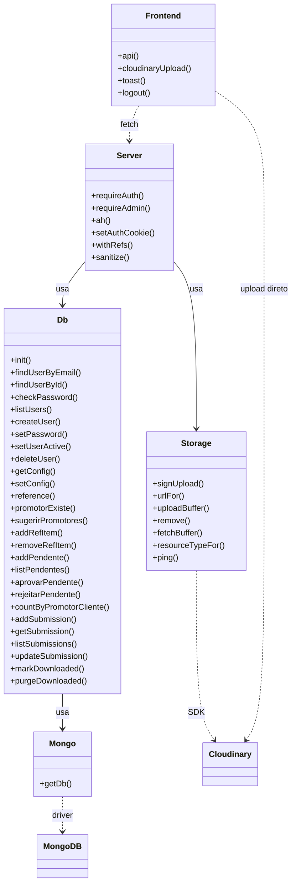
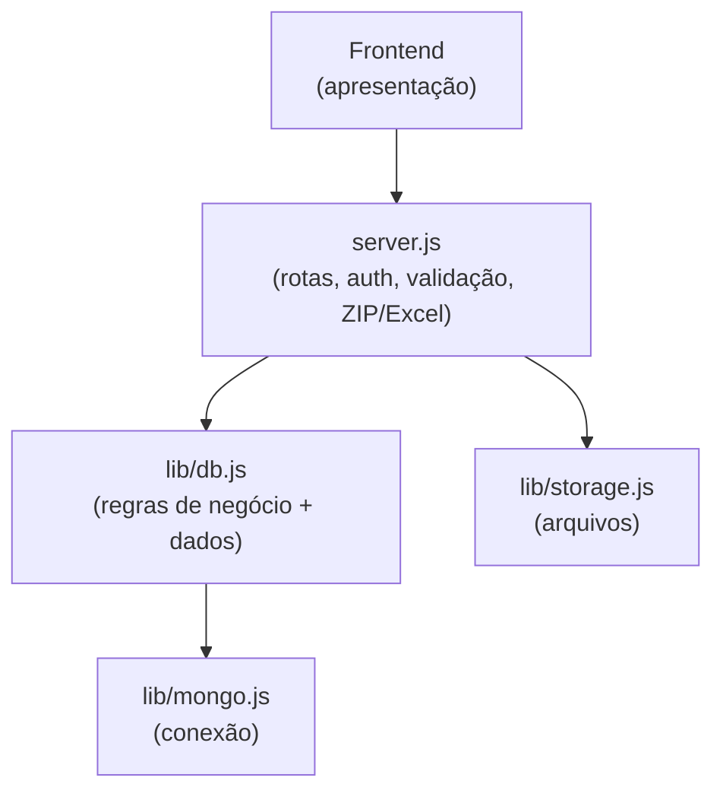

# 06 — Estrutura de Código (UML)

## Diagrama de classes / módulos

Cada módulo é tratado como uma "classe" com suas operações públicas.

> `Server` = `server.js` · `Db` = `lib/db.js` · `Mongo` = `lib/mongo.js` ·
> `Storage` = `lib/storage.js` · `Frontend` = `public/*.html` + `common.js`.

## Responsabilidades (separação de camadas)

| Módulo | Responsabilidade | NÃO faz |
|--------|------------------|---------|
| `server.js` | Roteamento HTTP, autenticação/autorização, validação de entrada, montagem de ZIP e Excel | Não fala direto com Mongo nem Cloudinary |
| `lib/db.js` | Regras de negócio e todo o acesso ao MongoDB (assíncrono) | Não conhece HTTP nem arquivos |
| `lib/mongo.js` | Conexão única e cacheada com o Mongo | Não conhece o domínio |
| `lib/storage.js` | Upload assinado, URL de entrega e remoção no Cloudinary | Não conhece o domínio |
| `public/` | Telas e interações; chama a API e o Cloudinary | Sem lógica de negócio sensível |

Essa separação é o que permitiu **trocar a infraestrutura sem reescrever as rotas**:
- banco de arquivo JSON → MongoDB (só mudou `lib/db.js`);
- disco local → Cloudinary (só mudou `lib/storage.js` + o fluxo de upload).

## Dependências (npm)

| Pacote | Uso |
|--------|-----|
| `express` | Servidor HTTP / rotas |
| `mongodb` | Driver do MongoDB |
| `cloudinary` | SDK de armazenamento de mídia |
| `jsonwebtoken` | Geração/validação do JWT |
| `cookie-parser` | Leitura do cookie de auth |
| `bcryptjs` | Hash de senhas |
| `archiver` | Geração de ZIP |
| `exceljs` | Geração de Excel |
| `dotenv` | Carregar `.env` |
