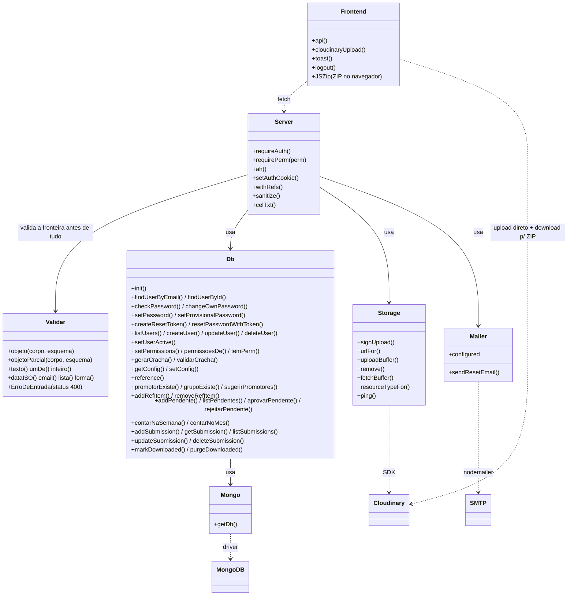
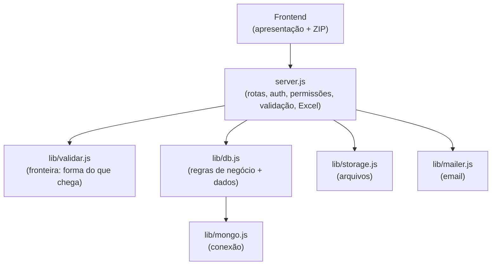

# 06 — Estrutura de Código (UML)

## Diagrama de classes / módulos

Cada módulo é tratado como uma "classe" com suas operações públicas.

> `Server` = `server.js` · `Db` = `lib/db.js` · `Mongo` = `lib/mongo.js` ·
> `Storage` = `lib/storage.js` · `Mailer` = `lib/mailer.js` ·
> `Validar` = `lib/validar.js` ·
> `Frontend` = `public/*.html` + `common.js` + `vendor/jszip.min.js`.
>
> `lib/tipos.js` não aparece no diagrama de propósito: são só `@typedef` de JSDoc, com
> zero runtime — ninguém o carrega, nem em produção nem em teste.

## Responsabilidades (separação de camadas)

| Módulo | Responsabilidade | NÃO faz |
|--------|------------------|---------|
| `server.js` | Roteamento HTTP, autenticação/autorização (JWT + permissões), validação de entrada, rate-limit, portão de concorrência, Excel (export e import de contas) | Não fala direto com Mongo nem Cloudinary |
| `lib/db.js` | Regras de negócio e todo o acesso ao MongoDB (assíncrono); constantes do domínio (regiões, permissões, limites) | Não conhece HTTP nem arquivos |
| `lib/mongo.js` | Conexão única e cacheada com o Mongo (pool 100) | Não conhece o domínio |
| `lib/storage.js` | Upload assinado, URL de entrega e remoção no Cloudinary | Não conhece o domínio |
| `lib/mailer.js` | Envio do email de redefinição de senha (nodemailer) | Não conhece o domínio |
| `lib/validar.js` | **Forma** do que chega do cliente: escalar vs. objeto, tetos, listas fechadas, mass assignment | Não conhece regra de negócio — quem julga se a senha é fraca ou se o ponto extra está na lista vigente é o `db` |
| `lib/tipos.js` | `@typedef` JSDoc dos contratos centrais, para o editor e o `tsc --noEmit` | **Não roda**: zero runtime, ninguém o carrega |
| `public/` | Telas e interações; chama a API e o Cloudinary; monta o ZIP (JSZip) | Sem lógica de negócio sensível |

Essa separação é o que permitiu **trocar a infraestrutura sem reescrever as rotas**:
- banco de arquivo JSON → MongoDB (só mudou `lib/db.js`);
- disco local → Cloudinary (só mudou `lib/storage.js` + o fluxo de upload);
- ZIP no servidor (`archiver`) → ZIP no navegador (JSZip) — o `archiver` foi removido.

## Dependências (npm)

| Pacote | Uso |
|--------|-----|
| `express` | Servidor HTTP / rotas |
| `mongodb` | Driver do MongoDB |
| `cloudinary` | SDK de armazenamento de mídia |
| `jsonwebtoken` | Geração/validação do JWT |
| `cookie-parser` | Leitura do cookie de auth |
| `bcryptjs` | Hash de senhas |
| `helmet` | Headers de segurança + CSP |
| `express-rate-limit` | Rate-limit no login e na recuperação de senha |
| `compression` | Gzip das respostas |
| `nodemailer` | Email de redefinição de senha |
| `exceljs` | Excel: export no molde oficial + import de contas por planilha |
| `dotenv` | Carregar `.env` |

> ZIP: **JSZip** roda no navegador e é **vendorado** em `public/vendor/jszip.min.js`
> (não é dependência npm). O `archiver` saiu do projeto junto com o ZIP no servidor.
