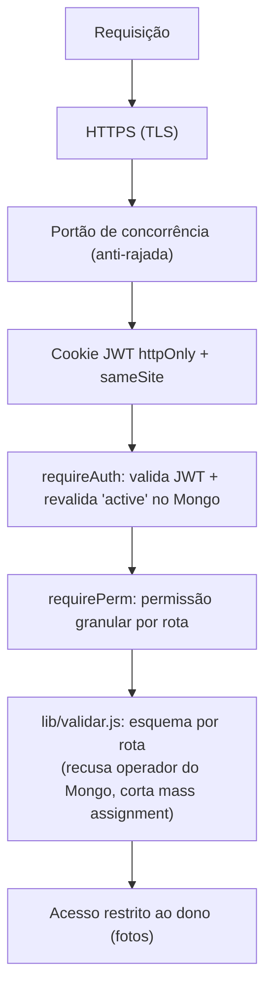

# 07 — Segurança

## Camadas atuais



### Autenticação — JWT
- Login confere a senha com **bcrypt assíncrono** (não trava o event loop em rajada de
  logins) e emite um **JWT** assinado com `SESSION_SECRET`, válido por 8h, guardado num
  cookie **`httpOnly`** (JS da página não lê), **`sameSite=lax`** e **`secure`** em
  produção (só trafega via HTTPS).
- Sem estado em memória → funciona em serverless.
- `requireAuth` **revalida** o usuário no Mongo (cache de 20s): um promotor **banido**
  (`active=false`) cai em 401 quase imediatamente, mesmo com token ainda válido.

### Autorização — permissões granulares + crachá
- Admin **não é tudo-ou-nada**: cada conta admin tem `permissions` —
  `fotos` (avaliar/baixar/exportar/excluir), `aprovar`, `contas`, `listas`, `aderencia` — e cada
  rota `/api/admin/*` exige a sua via **`requirePerm`** (senão **403**).
- **Admin novo nasce sem nenhuma permissão** (a menos que quem criou tenha acesso total).
- **Acesso total (`*`)** — inclusive configurar as permissões dos outros — só validando o
  **crachá**: código `MPDV-…` gerado uma única vez; no banco fica **apenas o sha256**;
  gerar um crachá novo **invalida o anterior**.
- Fotos: `/api/file/:id` só entrega para **admin** ou para o **dono** da submissão.
- Admin é **imune** a ban/exclusão (trava em `db.setUserActive` e `db.deleteUser`).

### Senhas
- Guardadas como **hash bcrypt** (custo 10). Nunca em texto, nunca logadas.
- **Senhas provisórias** (contas criadas em massa/por planilha, ou redefinidas pelo
  admin) marcam `mustChangePassword` — o front força a troca no 1º login
  (`trocar-senha.html`, via `/api/change-password`). Senha **"0"** é a variante
  "primeiro acesso": a pessoa entra com `0` e cria a própria senha numa tela de
  boas-vindas. Mesmo risco da provisória por nome (ambas adivinháveis até o 1º login) —
  aceito pro contexto interno; ver pendência de força de senha abaixo.
- **Recuperação por email**: token de 32 bytes aleatórios; no banco fica só o **sha256**,
  expira em **1h** e é de **uso único**. Resposta do `/api/forgot-password` é sempre
  genérica (anti-enumeração de emails).

### Armazenamento de arquivos (Cloudinary)
- Uploads são **`type: authenticated`**: a URL **só funciona assinada** — sem a
  assinatura, o Cloudinary responde **401**. A foto não é pública.
- O **upload direto** do navegador é **assinado pelo servidor** (`signUpload`): o
  `api_secret` **nunca** sai do backend; o navegador recebe só uma assinatura de uso único.
- A assinatura fixa a **pasta** (`folder`) — o navegador não consegue subir para fora dela.
- **Anti-abuso:** ao registrar, o servidor só aceita `publicId` que comece com
  `memphis-pdv/fotos/`; e apaga fotos órfãs se a validação falhar.

### Validação de entrada

**Camada de fronteira — `lib/validar.js` (ago/2026).** Um esquema declarado por rota,
sem dependência nova, rodando *antes* de qualquer trabalho. Fecha três coisas:

| Ameaça | Como fecha |
|---|---|
| Operador do Mongo no lugar de um valor (`{"cliente": {"$ne": null}}`, `?promotor[$regex]=.*`) | toda regra **exige escalar** e recusa objeto/array — recusa, não coage |
| *Mass assignment* | `objeto()` devolve **só** as chaves do esquema; o resto é descartado em silêncio. Erro seria pior: viraria um oráculo de quais campos o documento tem |
| Texto sem teto / lista sem teto | todo campo tem `max`; sem ele um POST de 1 MB vira documento de 1 MB no M0 |

Duas escolhas que parecem detalhe e não são:

- **`objetoParcial` no PATCH.** Campo ausente continua ausente. Se virasse string vazia,
  salvar a pré-avaliação apagaria o motivo da recusa junto — sem ninguém ter pedido.
- **Duas réguas de e-mail.** O cadastro público exige domínio completo; o painel aceita
  login interno sem ponto (`admin@local`, `mat…@sem-email.memphis.local`, o caminho de
  quem não tem e-mail). Apertar a régua do painel trancaria a operação do lado de fora
  do próprio sistema.

Rotas cobertas: `POST /api/signup`, `POST /api/submissions`,
`PATCH /api/admin/submissions/:id`, `PATCH /api/admin/users/:id`,
`POST /api/admin/ranking`, `POST /api/cracha/validar`,
`POST` e `DELETE /api/admin/senhas`, `POST /api/my/correcao-cadastro`.

O erro sobe como `ErroDeEntrada` com `status: 400`; o handler de erro do `server.js` já
honra `err.status`, então nenhuma rota precisa de `try/catch` próprio. A exceção é
`POST /api/submissions`, que **precisa** do `try`: um 400 ali ainda tem que apagar do
Cloudinary as imagens que já subiram, senão cada envio malformado deixa arquivo pago
para trás, sem nada no banco apontando para ele.

**Camadas anteriores (seguem valendo):**
- Campos obrigatórios checados em cada rota; `updateSubmission` só aceita uma
  **lista branca** de campos (`baixado, preAvaliacao, pontosExtra, validado, motivoRecusa, observacao, pago`)
  — o cliente não consegue gravar campos arbitrários. `pontosExtra` também tem o **valor**
  validado: só entram itens da lista vigente (aba Listas), senão texto solto viraria
  categoria fantasma nos gráficos. `permissions` na criação de conta
  só é aceito de quem tem acesso total.
- **XSS no painel (revisão jul/2026):** handlers `onclick` inline que interpolavam dados
  de usuário foram trocados por **`data-*` + event listeners** — dado de promotor/cliente
  não vira mais código.

### Anti-CSRF (revisão ago/2026)
- **Checagem de origem** em todo `POST/PUT/PATCH/DELETE` de `/api`: `Origin` (ou o
  `Referer`) precisa bater com o host da requisição, senão **403**. Requisição sem
  `Origin` passa — é cliente que não é navegador (curl, teste, script), e navegador
  **sempre** manda `Origin` quando a requisição vem de outra origem.
- **O parser `express.urlencoded` foi removido.** Só JSON é aceito. `application/
  x-www-form-urlencoded` é o único `Content-Type` que o navegador deixa passar **sem
  preflight CORS** — ou seja, é exatamente o que um `<form>` hospedado em outro site
  usaria. Nada no front usa form nativo, então não se perde nada.
- ⚠️ **Por que o `SameSite=Lax` não bastava:** "site", para o cookie, é o **domínio
  registrável**, e `discloud.app` **não está na Public Suffix List** (conferido contra a
  lista oficial). Logo `qualquer-app.discloud.app` conta como **mesmo site** que o nosso e
  o cookie viaja junto. Como qualquer pessoa publica um app no Discloud de graça, isso
  bastaria para forjar ações em nome de um admin logado. A checagem de origem não depende
  de PSL nem de `SameSite`, então resolve independentemente do host.

### Injeção de operador NoSQL
- `queryDeSubmissions` recebe `req.query` cru. O parser do Express transforma
  `?regiao[$ne]=X` num **objeto**, que iria direto para o Mongo como operador.
  Os quatro campos que entravam sem tratamento (`uploadedBy`, `regiao`, `grupo`,
  `preAvaliacao`) agora passam por `String()`. Desde ago/2026 há uma **segunda tranca**
  no corpo: `lib/validar.js` recusa qualquer valor não escalar antes de a rota rodar —
  as duas defesas são independentes de propósito, cada uma cobre uma porta.
- Não houve escalada de privilégio: a única rota que espalha `req.query` exige permissão
  `fotos`, e quem a tem já enxerga todas as fotos. `/api/my/submissions` **não** espalha
  `req.query` — monta o filtro só com `uploadedBy` da sessão. A correção é para não virar
  vazamento no dia em que alguém criar uma rota de escopo menor.

### Disponibilidade (anti-rajada)
- **Portão de concorrência**: máx. 300 requisições de API simultâneas + fila leve de
  8.000; acima disso, **503** imediato — protege a RAM em picos (validado com 5.000
  usuários simultâneos em `test/carga.js`).
- **Rate-limit**: login 10 falhas/15min por IP (sucesso não conta), recuperação de
  senha 20/15min, cadastro público 20/h e **validação de crachá 10 falhas/15min**
  (ele concede acesso total) → **429**.

### Segredos
- Tudo em `.env` (no `.gitignore`): `MONGODB_URI`, `CLOUDINARY_*`, `SESSION_SECRET`, `SMTP_*`.
- Em produção, as variáveis ficam no painel do host (Discloud/Vercel), não no código.

## Pentest (autorizado)

`test/pentest.js` ataca o próprio app (49 verificações). Resultado atual: **49 defesas OK, 0 achados.**
Cobre: exposição de arquivos sensíveis, travessia de diretório, acesso sem auth, **injeção
NoSQL** no login, **forja/adulteração de JWT**, **escalonamento de privilégio**, **mass
assignment**, **IDOR** (foto de outro promotor), abuso do upload assinado, **ReDoS/regex**
no autocomplete e **força-bruta** no login.

```bash
MONGO_DB=memphis_pdv_test node server.js
node test/pentest.js
```

> Rodar smoke e pentest sempre com o banco de teste **limpo** entre eles
> (o smoke troca senhas que o pentest usa).

## Status do endurecimento

| Item | Status | Observação |
|------|--------|-----------|
| Hash de senha (bcrypt) | ✅ | Assíncrono no login (não trava o event loop) |
| JWT httpOnly + secure | ✅ | Pronto |
| Entrega autenticada (Cloudinary) | ✅ | Pronto |
| Upload assinado (secret no servidor) | ✅ | Pronto |
| **Permissões granulares + crachá** | ✅ | `requirePerm` por rota; `*` só via crachá (hash no banco) |
| Autorização por dono (fotos) | ✅ | Pronto |
| Validação por whitelist (sem mass assignment) | ✅ | `updateSubmission`, envio e criação de conta |
| **XSS no painel (dados em onclick)** | ✅ | Corrigido na revisão jul/2026 — `data-*` + listeners |
| **Rate limit (login + reset)** | ✅ | `express-rate-limit`: 10 falhas/15min e 20/15min → 429 |
| **Portão de concorrência** | ✅ | 300 ativos + fila 8.000 → 503 educado |
| **Helmet (headers + CSP)** | ✅ | CSP libera só `self` + Cloudinary + Google Fonts; remove `X-Powered-By` |
| **robots.txt** | ✅ | `Disallow: /` (ferramenta interna, não indexável) |
| Limite de tamanho de corpo | ✅ | `express.json({ limit: '1mb' })` |
| Senha provisória + troca obrigatória | ✅⚠️ | Flag no banco + fluxo no front. **Pendência:** o servidor ainda não bloqueia as outras rotas enquanto a troca não acontece (quem ignora o redirect segue usando a API). |
| Força mínima de senha | ⬜ | Achado da revisão jul/2026 — hoje qualquer senha é aceita. |
| **Rotacionar segredos expostos** | ⬜ | Senha do Mongo e secret do Cloudinary passaram por chat — trocar antes do go-live. |
| **Admin padrão sem senha fixa** | ✅ | Seed lê `ADMIN_EMAIL`/`ADMIN_SENHA`; sem env, senha sorteada + troca obrigatória. Falta só trocar a senha da instalação atual pelo painel (mãos do dono). |
| **Boot aborta sem `SESSION_SECRET`** | ✅ | Em produção, segredo de dev no lugar do real = `throw` no boot (antes caía em fallback público e qualquer um forjava cookie de admin). |
| **CSRF (checagem de origem)** | ✅ | Revisão ago/2026. `Origin`/`Referer` conferidos em tudo que muda estado; `express.urlencoded` removido. **`SameSite=Lax` não bastava:** `discloud.app` não está na Public Suffix List, então outro app `*.discloud.app` conta como mesmo site. |
| **Injeção de operador NoSQL no filtro** | ✅ | `queryDeSubmissions` coage `uploadedBy/regiao/grupo/preAvaliacao` com `String()`. Sem escalada antes (rota exige `fotos`), mas era vazamento à espera de uma rota nova. |
| **Rate limit na validação do crachá** | ✅ | 10 falhas/15min. O código tem 128 bits (adivinhar já era inviável) — é a segunda tranca. |
| Validação por schema (zod) | ⬜ | Reforço opcional de tipos/limites. |
| Backup + auditoria | ⬜ | Snapshot do Mongo + log de ações sensíveis. |

> 🔸 **Rate limit em serverless:** o `express-rate-limit` em memória funciona num host
> **persistente** (Discloud). Na Vercel (serverless), cada instância tem sua própria
> contagem — ali precisaria de um store compartilhado (ex: Redis/Upstash).

## Minimização de exposição (Bloco 2, ago/2026)

Diretriz do dono: **"ninguém vê o nome de ninguém"**. O promotor tem direito de enviar a
foto, a data e o cliente — e nada mais.

### A raiz: o promotor digitava o próprio nome
Era herança da era do WhatsApp, quando não havia contas. O campo de texto livre criava
**três** problemas ao mesmo tempo:

| # | Problema | O que acontecia |
|---|---|---|
| 1 | **Privacidade** | O autocomplete devolvia colegas reais — digitar "MA" trazia 8 nomes. |
| 2 | **Integridade** | Dava para enviar foto **em nome de outra pessoa** — afetando cota, ranking, aderência e a quem o pagamento é atribuído. |
| 3 | 🔴 **Limites burláveis** | As travas de 1/semana e 4/mês contam por `norm(promotor)`. Digitando outro nome, a cota zerava: **as travas antifraude não travavam nada.** |

**Conserto:** `promotor`, `regiao` e `grupo` vêm da **sessão**, nunca do corpo. O formulário
caiu de sete campos para **três** (cliente, endereço, data + fotos).

### O que o promotor deixou de receber
- `/api/reference` é servida em **dois buffers pré-gzipados**, um por perfil: o do promotor
  não tem `promotores[]` (2.050 nomes) nem `grupos[]`.
  ⚠️ **Trocar os buffers entregaria a lista inteira a 1.400 pessoas** — por isso a escolha
  acontece num ponto só e há caso de teste dedicado, inclusive na via gzipada.
- `/api/check-promotor` e `/api/promotor-pendente` passaram a exigir admin.
- **Exceção declarada:** `/api/ranking` mostra o **nome completo** dos vencedores a todos os
  logados. É escolha consciente — premiação divulgada é finalidade própria — e está na
  política de privacidade.

### Contrapartidas
- **Confirmação de cadastro:** como o promotor não digita mais nome/grupo/região, ele
  confere na tela. "Está errado" **não abre campo de texto para os dados** (isso reabriria o
  buraco) — abre um **pedido de correção** que cai na fila da equipe, com texto livre só
  para descrever o problema. Um pedido em aberto por pessoa.
- **Correção de autoria:** os casos legítimos existem (um supervisor lança a foto de quem
  está sem celular). Antes a equipe era avisada e **não tinha como consertar**. Agora
  `PATCH /api/admin/submissions/:id` aceita `promotor` **se** vier com
  `permitirTrocarAutor: true` — explícito, só admin, e sempre auditado.

### URLs de imagem com expiração
⚠️ **Medido, não suposto:** o Cloudinary **ignora `expires_at` em URL de entrega**
(`res.cloudinary.com`) — a URL sai byte a byte idêntica com e sem o campo. Expiração real
em URL de entrega exige *token-based auth*, recurso de plano pago.

Solução adotada, com a divisão onde cada lado ganha o que precisa:

| Caminho | URL | Por quê |
|---|---|---|
| **Manifesto do ZIP** e **backup** | `private_download_url` com **1h** (testado: 200 dentro do prazo, **401** depois) | É aqui que mora o risco: o manifesto entrega centenas de links de uma vez, e é o que sobra salvo se vazar. Entrega o **original**, que é o que o acervo precisa. |
| **Exibição na tela** (`/api/file/:id`) | URL assinada com `f_auto,q_auto` | Gerada a cada requisição, atrás de login, e usada na hora. Mantém a otimização que corta o peso da foto no celular — `private_download_url` não aceita transformação. |

> 📋 O **registro de operações de tratamento** (campo × finalidade × base legal ×
> retenção × quem acessa) está em [09 — LGPD](09-lgpd.md).

## Backup e reset de cadastros (LGPD 1.8)

⚠️ **O backup é dado pessoal** — não é um arquivo neutro, é a base inteira de pessoas.
Por isso: retenção declarada de **5 meses**, acesso restrito a **acesso total**, entrega
sempre por **URL assinada** (arquivo `raw` autenticado no Cloudinary) e expiração
automática na mesma rotina diária da retenção.

| Rota | Acesso | O que faz |
|---|---|---|
| `POST /api/admin/backup` | 🪪 `*` | Dump de `users`, `promotores`, `refdata` e `config`. |
| `GET /api/admin/backup` | 🪪 `*` | Lista os backups e a retenção declarada. |
| `GET /api/admin/backup/baixar?arquivo=` | 🪪 `*` | **302** → URL assinada. Sem caminho de volta, "ter backup" seria teatro. |
| `POST /api/admin/reset-cadastros` | 🪪 `*` | Apaga a base de pessoas. Ver cerimônia abaixo. |
| `POST /api/admin/submissions/excluir-tudo` | 🪪 `*` | Apaga todas as fotos. Mesma cerimônia (palavra `EXCLUIR`), sem o backup — foto se guarda pelo ZIP. |

**Cerimônia do reset** (é a ação mais destrutiva do sistema — apaga o cadastro de ~1.400
pessoas, e um clique errado aqui não tem desfazer):
1. **Só com acesso total** (crachá) — não basta a permissão `contas`.
2. **Confirmação por digitação** da palavra `RESETAR`, não um `confirm()` de uma tecla.
3. **Backup automático ANTES, obrigatório.** Se o backup falhar, a operação **aborta** —
   não segue "porque o usuário mandou". Testado em `test/reset.js`.
4. **Registro na auditoria**, com quem, quando, quanto e qual backup.
5. **Nunca apaga quem executou** nem os outros admins — senão o sistema fica sem
   administrador e ninguém entra.

> **Conflito com o direito de eliminação, declarado na política:** se um titular pedir
> exclusão e existir backup com os dados dele, não dá para "apagar do backup" sem corromper
> o arquivo. Prática adotada: backups **não são usados para reprocessar dados** e expiram
> sozinhos no prazo declarado.

## Front-end, SEO e acessibilidade (revisão ago/2026)

| Item | Estado | Observação |
|---|---|---|
| **Segredos no cliente** | ✅ | Nada de `sk_`/`api_secret` em `public/`; nenhum `process.env` no front. `signUpload` manda só `apiKey`/`cloudName` (públicos por design) — o `api_secret` fica no servidor. `.env` no `.gitignore` e **nunca commitado**. |
| **Cookies** | ✅ | **Um só**: `mp_token` — `HttpOnly`, `SameSite=Lax`, `Secure` em produção, 8h, `Path=/`. Zero `localStorage`/`sessionStorage`. É o que a política de privacidade declara. |
| **Banner de cookies** | ✅ *(ausência correta)* | Cookie estritamente necessário **não exige** banner — exige aviso, que está na política. Pôr banner aqui pediria consentimento para algo que não se pode recusar. |
| **404 customizada** | ✅ | `public/404.html`. Antes vinha o "Cannot GET /x" do Express, que ainda entregava a stack. `/api/*` responde JSON (`{ error }`), navegação responde a página. |
| **robots.txt** | ✅ | `Disallow: /` — ferramenta interna não deve ser indexada. |
| **sitemap.xml** | ✅ *(ausência correta)* | Sitemap serve para guiar indexação; com `Disallow: /` seria contraditório. Não criar. |
| **`<title>` por página** | ✅ | Todas as 11 páginas têm título próprio e descritivo. |
| **`<meta description>`** | ➖ | Ausente em quase todas. Só tem valor em página indexável — não é o caso. O hub ganhou uma no Bloco 5, por ser a porta de entrada. |
| **`alt` nas imagens** | ✅ | Corrigido: as 3 fotos dinâmicas (galeria do painel e "minhas fotos") não tinham `alt`; agora descrevem cliente e nº da imagem. |
| **Estados de erro nos formulários** | ✅ | Corrigido: `promotor.html` — a tela de 1.400 pessoas — reportava **tudo** só por toast, que some em 2,6 s. Ganhou o `.err` com `role="alert"` que as outras telas já tinham; o toast continua. |
| **CTA acima da dobra** | ✅ | Corrigido: em Android de 640 px o "Entrar no módulo" caía **abaixo** da dobra (707 px). Hero compactado só no mobile → 619 px. ⚠️ O Bloco 5 quase desfez isto: `.theme-dark .lp-hero` tem especificidade maior que o `.lp-hero` do bloco mobile e sobrescrevia o enxugamento — a capa carrega overrides próprios dentro do `@media` justamente para não reintroduzir o problema. |
| **Contraste sobre vidro** | ✅ | Os tons foram **calculados** contra o ponto mais claro possível do fundo com o cartão em hover, não estimados. Pior razão da capa: 4,78:1. `--muted` subiu de `#9aa0a6` (3,66:1, reprovado) para `#b0b7bf`, e o selo "em breve" passou a usar tinta escura — empilhar mais branco sobre vidro derrubava o próprio texto dele para 4,27:1. |
| **Contraste nas 14 telas** | ✅ | Auditoria rodada **dentro da página**, compondo a pilha real de fundos de cada elemento de texto (o script está no commit do Bloco 5). Achou 9 reprovações, das quais **7 eram pré-existentes** e valiam também no tema claro — ver a linha abaixo. Estado final: 0 reprovações em login, cadastro, painel (Fotos, Aderência, Gráficos), promotor, política, ranking, 404 e as três landings. |
| **Texto branco sobre preenchimento colorido** | ✅ | 🔴 **Achado pré-existente, não introduzido pelo tema escuro.** `#fff` sobre `--teal` dava **3,20:1** — e isso era o **botão de ação principal de toda tela**, mais a aba ativa e o crachá. Quatro cores de ponto extra também reprovavam (teal 3,20, verde 3,42, laranja 3,01, rosa 4,19), e o selo dentro da aba ativa dava 2,45:1. Causa comum: a mesma variável servia de **cor de marca** (borda, ícone, série de gráfico) e de **superfície que carrega texto branco**, dois papéis com exigências opostas. Resolvido separando os tokens `--teal-fill`, `--purple-fill`, `--green-fill`, `--red-fill` e `--yellow-fill`, todos ≥4,76:1 com branco e **iguais nos dois temas** — a exigência vem do texto branco, não do fundo da página. |
| **Link da política antes do login** | ✅ | Corrigido no Bloco 5: o item do 1.1 previa o link no rodapé de `index.html` e `login.html` e ele nunca tinha entrado. Quem ainda não entrou também é titular. |
| **Imagens comprimidas** | ✅ | Único estático é o logo (37 KB, WebP). As fotos agora são entregues com `f_auto,q_auto` **na tela** — ⚠️ o ZIP do lote continua baixando o **original**, porque é o arquivo que vai para o servidor interno e vive a longo prazo. |
