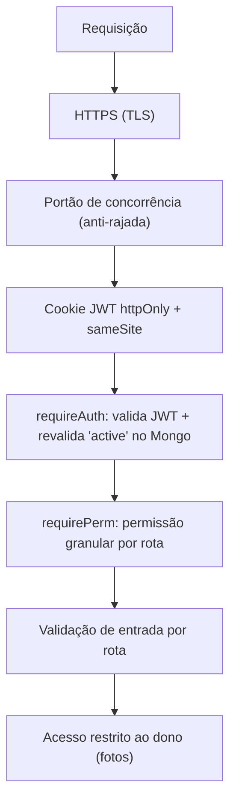

# 07 — Segurança

## Camadas atuais



### Autenticação — JWT
- Login confere a senha com **bcrypt assíncrono** (não trava o event loop em rajada de
  logins) e emite um **JWT** assinado com `SESSION_SECRET`, válido por 8h, guardado num
  cookie **`httpOnly`** (JS da página não lê), **`sameSite=lax`** e **`secure`** em
  produção (só trafega via HTTPS).
- Sem estado em memória → funciona em serverless.
- `requireAuth` **revalida** o usuário no Mongo (cache de 20s): um promotor **banido**
  (`active=false`) cai em 401 quase imediatamente, mesmo com token ainda válido.

### Autorização — permissões granulares + crachá
- Admin **não é tudo-ou-nada**: cada conta admin tem `permissions` —
  `fotos` (avaliar/baixar/exportar/excluir), `aprovar`, `contas`, `listas`, `aderencia` — e cada
  rota `/api/admin/*` exige a sua via **`requirePerm`** (senão **403**).
- **Admin novo nasce sem nenhuma permissão** (a menos que quem criou tenha acesso total).
- **Acesso total (`*`)** — inclusive configurar as permissões dos outros — só validando o
  **crachá**: código `MPDV-…` gerado uma única vez; no banco fica **apenas o sha256**;
  gerar um crachá novo **invalida o anterior**.
- Fotos: `/api/file/:id` só entrega para **admin** ou para o **dono** da submissão.
- Admin é **imune** a ban/exclusão (trava em `db.setUserActive` e `db.deleteUser`).

### Senhas
- Guardadas como **hash bcrypt** (custo 10). Nunca em texto, nunca logadas.
- **Senhas provisórias** (contas criadas em massa/por planilha, ou redefinidas pelo
  admin) marcam `mustChangePassword` — o front força a troca no 1º login
  (`trocar-senha.html`, via `/api/change-password`). Senha **"0"** é a variante
  "primeiro acesso": a pessoa entra com `0` e cria a própria senha numa tela de
  boas-vindas. Mesmo risco da provisória por nome (ambas adivinháveis até o 1º login) —
  aceito pro contexto interno; ver pendência de força de senha abaixo.
- **Recuperação por email**: token de 32 bytes aleatórios; no banco fica só o **sha256**,
  expira em **1h** e é de **uso único**. Resposta do `/api/forgot-password` é sempre
  genérica (anti-enumeração de emails).

### Armazenamento de arquivos (Cloudinary)
- Uploads são **`type: authenticated`**: a URL **só funciona assinada** — sem a
  assinatura, o Cloudinary responde **401**. A foto não é pública.
- O **upload direto** do navegador é **assinado pelo servidor** (`signUpload`): o
  `api_secret` **nunca** sai do backend; o navegador recebe só uma assinatura de uso único.
- A assinatura fixa a **pasta** (`folder`) — o navegador não consegue subir para fora dela.
- **Anti-abuso:** ao registrar, o servidor só aceita `publicId` que comece com
  `memphis-pdv/fotos/`; e apaga fotos órfãs se a validação falhar.

### Validação de entrada
- Campos obrigatórios checados em cada rota; `updateSubmission` só aceita uma
  **lista branca** de campos (`baixado, preAvaliacao, pontosExtra, validado, motivoRecusa, observacao, pago`)
  — o cliente não consegue gravar campos arbitrários. `pontosExtra` também tem o **valor**
  validado: só entram itens da lista vigente (aba Listas), senão texto solto viraria
  categoria fantasma nos gráficos. `permissions` na criação de conta
  só é aceito de quem tem acesso total.
- **XSS no painel (revisão jul/2026):** handlers `onclick` inline que interpolavam dados
  de usuário foram trocados por **`data-*` + event listeners** — dado de promotor/cliente
  não vira mais código.

### Disponibilidade (anti-rajada)
- **Portão de concorrência**: máx. 300 requisições de API simultâneas + fila leve de
  8.000; acima disso, **503** imediato — protege a RAM em picos (validado com 5.000
  usuários simultâneos em `test/carga.js`).
- **Rate-limit**: login 10 falhas/15min por IP (sucesso não conta) e recuperação de
  senha 20/15min → **429**.

### Segredos
- Tudo em `.env` (no `.gitignore`): `MONGODB_URI`, `CLOUDINARY_*`, `SESSION_SECRET`, `SMTP_*`.
- Em produção, as variáveis ficam no painel do host (Discloud/Vercel), não no código.

## Pentest (autorizado)

`test/pentest.js` ataca o próprio app (40 verificações). Resultado atual: **40 defesas OK, 0 achados.**
Cobre: exposição de arquivos sensíveis, travessia de diretório, acesso sem auth, **injeção
NoSQL** no login, **forja/adulteração de JWT**, **escalonamento de privilégio**, **mass
assignment**, **IDOR** (foto de outro promotor), abuso do upload assinado, **ReDoS/regex**
no autocomplete e **força-bruta** no login.

```bash
MONGO_DB=memphis_pdv_test node server.js
node test/pentest.js
```

> Rodar smoke e pentest sempre com o banco de teste **limpo** entre eles
> (o smoke troca senhas que o pentest usa).

## Status do endurecimento

| Item | Status | Observação |
|------|--------|-----------|
| Hash de senha (bcrypt) | ✅ | Assíncrono no login (não trava o event loop) |
| JWT httpOnly + secure | ✅ | Pronto |
| Entrega autenticada (Cloudinary) | ✅ | Pronto |
| Upload assinado (secret no servidor) | ✅ | Pronto |
| **Permissões granulares + crachá** | ✅ | `requirePerm` por rota; `*` só via crachá (hash no banco) |
| Autorização por dono (fotos) | ✅ | Pronto |
| Validação por whitelist (sem mass assignment) | ✅ | `updateSubmission`, envio e criação de conta |
| **XSS no painel (dados em onclick)** | ✅ | Corrigido na revisão jul/2026 — `data-*` + listeners |
| **Rate limit (login + reset)** | ✅ | `express-rate-limit`: 10 falhas/15min e 20/15min → 429 |
| **Portão de concorrência** | ✅ | 300 ativos + fila 8.000 → 503 educado |
| **Helmet (headers + CSP)** | ✅ | CSP libera só `self` + Cloudinary + Google Fonts; remove `X-Powered-By` |
| **robots.txt** | ✅ | `Disallow: /` (ferramenta interna, não indexável) |
| Limite de tamanho de corpo | ✅ | `express.json({ limit: '1mb' })` |
| Senha provisória + troca obrigatória | ✅⚠️ | Flag no banco + fluxo no front. **Pendência:** o servidor ainda não bloqueia as outras rotas enquanto a troca não acontece (quem ignora o redirect segue usando a API). |
| Força mínima de senha | ⬜ | Achado da revisão jul/2026 — hoje qualquer senha é aceita. |
| **Rotacionar segredos expostos** | ⬜ | Senha do Mongo e secret do Cloudinary passaram por chat — trocar antes do go-live. |
| **Admin padrão sem senha fixa** | ✅ | Seed lê `ADMIN_EMAIL`/`ADMIN_SENHA`; sem env, senha sorteada + troca obrigatória. Falta só trocar a senha da instalação atual pelo painel (mãos do dono). |
| **Boot aborta sem `SESSION_SECRET`** | ✅ | Em produção, segredo de dev no lugar do real = `throw` no boot (antes caía em fallback público e qualquer um forjava cookie de admin). |
| Validação por schema (zod) | ⬜ | Reforço opcional de tipos/limites. |
| Backup + auditoria | ⬜ | Snapshot do Mongo + log de ações sensíveis. |

> 🔸 **Rate limit em serverless:** o `express-rate-limit` em memória funciona num host
> **persistente** (Discloud). Na Vercel (serverless), cada instância tem sua própria
> contagem — ali precisaria de um store compartilhado (ex: Redis/Upstash).
