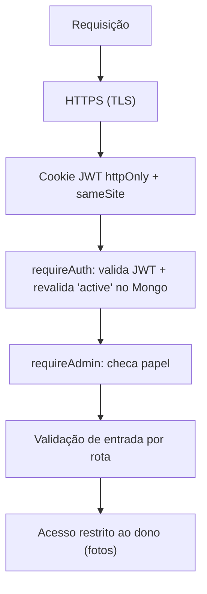

# 07 — Segurança

## Camadas atuais



### Autenticação — JWT
- Login confere a senha com **bcrypt** (`compareSync`) e emite um **JWT** assinado
  com `SESSION_SECRET`, válido por 8h, guardado num cookie **`httpOnly`** (JS da página
  não lê), **`sameSite=lax`** e **`secure`** em produção (só trafega via HTTPS).
- Sem estado em memória → funciona em serverless.
- `requireAuth` **revalida** o usuário no Mongo a cada requisição: um promotor **banido**
  (`active=false`) cai em 401 imediatamente, mesmo com token ainda válido.

### Autorização
- `requireAdmin` protege todas as rotas `/api/admin/*`.
- Fotos: `/api/file/:id` só entrega para **admin** ou para o **dono** da submissão.
- Admin é **imune** a ban/exclusão (trava em `db.setUserActive` e `db.deleteUser`).

### Senhas
- Guardadas como **hash bcrypt** (custo 10). Nunca em texto, nunca logadas.

### Armazenamento de arquivos (Cloudinary)
- Uploads são **`type: authenticated`**: a URL **só funciona assinada** — sem a
  assinatura, o Cloudinary responde **401**. A foto não é pública.
- O **upload direto** do navegador é **assinado pelo servidor** (`signUpload`): o
  `api_secret` **nunca** sai do backend; o navegador recebe só uma assinatura de uso único.
- A assinatura fixa a **pasta** (`folder`) — o navegador não consegue subir para fora dela.
- **Anti-abuso:** ao registrar, o servidor só aceita `publicId` que comece com
  `memphis-pdv/fotos/`; e apaga fotos órfãs se a validação falhar.

### Validação de entrada
- Campos obrigatórios checados em cada rota; `updateSubmission` só aceita uma
  **lista branca** de campos (`baixado, preAvaliacao, pontosExtra, validado, observacao, pago`)
  — o cliente não consegue gravar campos arbitrários.

### Segredos
- Tudo em `.env` (no `.gitignore`): `MONGODB_URI`, `CLOUDINARY_*`, `SESSION_SECRET`.
- Em produção, as variáveis ficam no painel da Vercel (não no código).

## Pentest (autorizado)

`test/pentest.js` ataca o próprio app (38 verificações). Resultado atual: **38 defesas OK, 0 achados.**
Cobre: exposição de arquivos sensíveis, travessia de diretório, acesso sem auth, **injeção
NoSQL** no login, **forja/adulteração de JWT**, **escalonamento de privilégio**, **mass
assignment**, **IDOR** (foto de outro promotor), abuso do upload assinado, **ReDoS/regex**
no autocomplete e **força-bruta** no login.

```bash
MONGO_DB=memphis_pdv_test node server.js
node test/pentest.js
```

## Status do endurecimento

| Item | Status | Observação |
|------|--------|-----------|
| Hash de senha (bcrypt) | ✅ | Pronto |
| JWT httpOnly + secure | ✅ | Pronto |
| Entrega autenticada (Cloudinary) | ✅ | Pronto |
| Upload assinado (secret no servidor) | ✅ | Pronto |
| Autorização por papel + dono | ✅ | Pronto |
| Validação por whitelist (sem mass assignment) | ✅ | `updateSubmission` e envio só aceitam campos previstos |
| **Rate limit no login** | ✅ | `express-rate-limit`: 10 tentativas / 15 min por IP → 429 |
| **Helmet (headers + CSP)** | ✅ | CSP libera só `self` + Cloudinary + Google Fonts; remove `X-Powered-By` |
| **robots.txt** | ✅ | `Disallow: /` (ferramenta interna, não indexável) |
| Limite de tamanho de corpo | ✅ | `express.json({ limit: '1mb' })` |
| **Rotacionar segredos expostos** | ⬜ | Senha do Mongo e secret do Cloudinary passaram por chat — trocar antes do go-live. |
| **Trocar admin padrão** | ⬜ | `admin@local` / `admin123` é só semente. |
| Validação por schema (zod) | ⬜ | Reforço opcional de tipos/limites. |
| Backup + auditoria | ⬜ | Snapshot do Mongo + log de ações sensíveis. |

> ⚠️ **Verificar no navegador:** o CSP foi configurado pelas origens conhecidas
> (scripts/estilos inline, Cloudinary, Google Fonts). Se aparecer algum erro de CSP no
> console ao abrir o app real, é só ajustar a diretiva correspondente.
>
> 🔸 **Rate limit em serverless:** o `express-rate-limit` em memória funciona num host
> **persistente** (Discloud). Na Vercel (serverless), cada instância tem sua própria
> contagem — ali precisaria de um store compartilhado (ex: Redis/Upstash).
