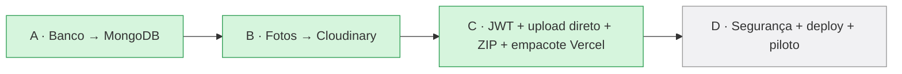
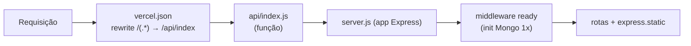

# 08 — Deploy & Operação

## Estado atual da migração para a nuvem



| Passo | Status |
|-------|--------|
| A — Banco no **MongoDB Atlas** | ✅ Feito |
| B — Fotos no **Cloudinary** | ✅ Feito |
| C1 — Sessão → **JWT** | ✅ Feito |
| C2 — **Upload direto** browser→Cloudinary | ✅ Feito |
| C3 — **ZIP no navegador** (JSZip) | ✅ Feito |
| C4 — Empacotar pra **Vercel** (`vercel.json` + `api/index.js`) | ✅ Feito |
| D — Endurecimento de segurança + deploy + piloto | ⬜ Próximo |

## Como o empacotamento serverless funciona (C4)

- `server.js` **exporta o app** (`module.exports = app`) e só chama `app.listen`
  quando rodado direto (`require.main === module`) — ou seja, **local** sobe servidor HTTP;
  na **Vercel** o app é importado como função.
- Um middleware **`ready`** (lazy + cacheado) garante que o Mongo conectou/seedou antes
  de qualquer rota — roda **1× por instância** serverless.
- `api/index.js` é o entrypoint da função: `module.exports = require('../server.js')`.
- `vercel.json` reencaminha **todas** as rotas para essa função e inclui os arquivos
  estáticos (`public/`, `data/`, `lib/`) no pacote da função (`includeFiles`).



## Como subir na Vercel (passo a passo — feito por você)

1. **Conta:** criar conta grátis em vercel.com (Hobby, sem cartão).
2. **Código:** subir o projeto pra um repositório (GitHub) **ou** usar a CLI:
   `npm i -g vercel` e rodar `vercel` na pasta do projeto.
3. **Importar o projeto** na Vercel (framework: *Other* — ele detecta o `vercel.json`).
4. **Variáveis de ambiente** (Project → Settings → Environment Variables): cadastrar
   `MONGODB_URI`, `MONGO_DB`, `CLOUDINARY_CLOUD_NAME`, `CLOUDINARY_API_KEY`,
   `CLOUDINARY_API_SECRET`, `SESSION_SECRET`, `NODE_ENV=production`.
5. **MongoDB Atlas → Network Access:** liberar `0.0.0.0/0` (a Vercel usa IPs dinâmicos)
   ou a lista de IPs da Vercel.
6. **Deploy.** A URL fica tipo `pdv-memphis.vercel.app`.
7. Primeiro acesso: trocar a senha do admin padrão.

> ⚠️ Antes do go-live, **rotacionar** a senha do MongoDB e o `CLOUDINARY_API_SECRET`
> (passaram por chat). Ver [07 — Segurança](07-seguranca.md).

## Hospedagem-alvo: Vercel (serverless)

A aplicação Express será empacotada como **função serverless**. Pontos já resolvidos
para esse modelo:
- **Sem estado em memória:** autenticação por JWT, sem `MemoryStore`.
- **Sem disco:** arquivos no Cloudinary.
- **Upload não passa pela função:** vai direto do navegador pro Cloudinary (contorna o
  limite de ~4,5 MB de corpo das funções).
- **ZIP grande:** migra para o navegador (JSZip) no passo C3 — evita o timeout das funções.
- **Conexão Mongo cacheada** entre invocações.

## Variáveis de ambiente

| Variável | Descrição |
|----------|-----------|
| `MONGODB_URI` | String de conexão do MongoDB Atlas |
| `MONGO_DB` | Nome do banco (`memphis_pdv`; `memphis_pdv_test` nos testes) |
| `CLOUDINARY_CLOUD_NAME` | Cloud name do Cloudinary |
| `CLOUDINARY_API_KEY` | API key do Cloudinary |
| `CLOUDINARY_API_SECRET` | API secret (NUNCA exposto ao cliente) |
| `SESSION_SECRET` | Segredo para assinar o JWT |
| `NODE_ENV` | `production` ativa o cookie `secure` |

> Em produção, configurar todas no painel da Vercel (Project → Settings → Environment Variables).
> **Nunca** comitar o `.env`.

## Rodar localmente

```bash
npm install
# criar .env com as variáveis acima
node server.js          # http://localhost:3000
```

No primeiro boot o servidor conecta no Mongo, cria índices e semeia
admin + promotores/grupos/clientes.

## Operação

| Tarefa | Como |
|--------|------|
| Acesso admin inicial | `admin@local` / `admin123` (trocar) |
| Reimportar dados das planilhas | `node tools/importar-planilhas.js` (ajustar caminhos no topo) |
| Rodar regressão | subir com `MONGO_DB=memphis_pdv_test` e `node test/smoke.js` |
| Trocar senha da campanha | Painel → Listas → Senhas atuais |
| Limpar lote após baixar | Painel → Fotos → "Limpar baixados" (apaga Mongo + Cloudinary) |

## Capacidade (escala ~1.4k promotores)

- **MongoDB Atlas free (M0, 512 MB):** suficiente — guarda só texto, e o fluxo de
  "baixar e limpar" mantém o volume baixo.
- **Cloudinary free (25 GB):** folgado para o ciclo, ainda mais com a compressão
  no navegador (~150–400 KB por foto) e a limpeza por lote.
- **Pico real é baixo:** envios são pingados ao longo do dia, não simultâneos.
- O único processo pesado (ZIP grande) é raro e do lado da equipe — resolvido no C3.
