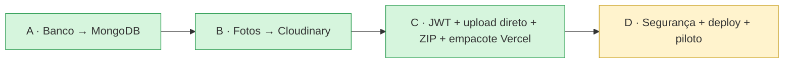
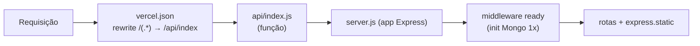

# 08 — Deploy & Operação

## Estado atual da migração para a nuvem



| Passo | Status |
|-------|--------|
| A — Banco no **MongoDB Atlas** | ✅ Feito |
| B — Fotos no **Cloudinary** | ✅ Feito |
| C1 — Sessão → **JWT** | ✅ Feito |
| C2 — **Upload direto** browser→Cloudinary | ✅ Feito |
| C3 — **ZIP no navegador** (JSZip) | ✅ Feito |
| C4 — Empacotar pra **Vercel** (`vercel.json` + `api/index.js`) | ✅ Feito |
| D1 — Endurecimento de segurança (helmet, rate-limit, pentest, permissões) | ✅ Feito |
| D2 — Rotacionar segredos + trocar admin padrão | ⬜ Antes do go-live |
| D3 — Deploy real + piloto | ⬜ Depende de conta/env do usuário |

## Onde hospedar

O app roda **nos dois modelos** sem mudar código:

| Host | Modelo | Situação |
|------|--------|----------|
| **Discloud** | Processo Node **persistente** (`node server.js`) | **Alvo provável** — o usuário já usa pra outro app. `discloud.config` pronto (TYPE=site, MAIN=server.js, RAM=512). Vantagens: rate-limit e portão de concorrência em memória funcionam de verdade; sem timeout de função. |
| **Vercel** | Função **serverless** | Empacote pronto (C4). Atenção: rate-limit por instância (precisaria de Redis pra valer globalmente). |

## Como o empacotamento serverless funciona (C4)

- `server.js` **exporta o app** (`module.exports = app`) e só chama `app.listen`
  quando rodado direto (`require.main === module`) — ou seja, **local/Discloud** sobe
  servidor HTTP; na **Vercel** o app é importado como função.
- Um middleware **`ready`** (lazy + cacheado) garante que o Mongo conectou/seedou antes
  de qualquer rota — roda **1× por instância** serverless.
- `api/index.js` é o entrypoint da função: `module.exports = require('../server.js')`.
- `vercel.json` reencaminha **todas** as rotas para essa função e inclui os arquivos
  estáticos (`public/`, `data/`, `lib/`) no pacote da função (`includeFiles`).



## Como subir (passo a passo — feito por você)

**Discloud:** zipar o projeto (sem `node_modules`), `discloud.config` já está na raiz,
subir pelo painel/bot e configurar as variáveis de ambiente (ou incluir o `.env` no zip —
**nunca** no GitHub público).

**Vercel:**
1. **Conta:** criar conta grátis em vercel.com (Hobby, sem cartão).
2. **Código:** subir o projeto pra um repositório (GitHub) **ou** usar a CLI:
   `npm i -g vercel` e rodar `vercel` na pasta do projeto.
3. **Importar o projeto** na Vercel (framework: *Other* — ele detecta o `vercel.json`).
4. **Variáveis de ambiente** (Project → Settings → Environment Variables): cadastrar
   as da tabela abaixo.
5. **MongoDB Atlas → Network Access:** liberar `0.0.0.0/0` (IPs dinâmicos)
   ou a lista de IPs do host.
6. **Deploy.** A URL fica tipo `pdv-memphis.vercel.app`.
7. Primeiro acesso: trocar a senha do admin padrão e gerar o crachá de acesso total.

> ⚠️ Antes do go-live, **rotacionar** a senha do MongoDB e o `CLOUDINARY_API_SECRET`
> (passaram por chat). Ver [07 — Segurança](07-seguranca.md).

## Variáveis de ambiente

| Variável | Descrição |
|----------|-----------|
| `MONGODB_URI` | String de conexão do MongoDB Atlas |
| `MONGO_DB` | Nome do banco (`memphis_pdv`; `memphis_pdv_test` nos testes) |
| `CLOUDINARY_CLOUD_NAME` | Cloud name do Cloudinary |
| `CLOUDINARY_API_KEY` | API key do Cloudinary |
| `CLOUDINARY_API_SECRET` | API secret (NUNCA exposto ao cliente) |
| `SESSION_SECRET` | Segredo para assinar o JWT — **obrigatório em produção** (sem ele o boot aborta de propósito) |
| `ADMIN_EMAIL` / `ADMIN_SENHA` | Credenciais do admin semeado no 1º boot; sem `ADMIN_SENHA`, a senha é sorteada e mostrada uma vez no log (troca obrigatória) |
| `LGPD_BLOQUEIA` | `1` **tranca a API** de quem ainda não aceitou a política (403 + `precisaAceitar`). Sobe **desligado** de propósito: ligar de véspera travaria 1.4 mil promotores no dia do piloto. Ligue depois de validar com um grupo pequeno — a tela de aceite já aparece com ele desligado. Vale para **todos**, inclusive admins. |
| `NODE_ENV` | `production` ativa o cookie `secure` |
| `PORT` / `HOST` | Porta/host do listen (Discloud exige 8080 + 0.0.0.0 — já é o padrão) |
| `SMTP_HOST` / `SMTP_PORT` / `SMTP_USER` / `SMTP_PASS` | SMTP do email de redefinição de senha (ex: Gmail App Password) |
| `MAIL_FROM` | Remetente do email de redefinição |
| `APP_URL` | URL pública do app (usada no link de redefinição) |

> Sem SMTP configurado, o "esqueci minha senha" funciona em modo dev (mostra o link
> na resposta, só fora de produção). **Nunca** comitar o `.env`.

## Rodar localmente

```bash
npm install
# criar .env com as variáveis acima
node server.js               # produção local — http://localhost:8080
node tools/dev-preview.js    # desenvolvimento — porta 3000, SEMPRE no banco de teste
```

No primeiro boot o servidor conecta no Mongo, cria índices e semeia
admin + promotores/grupos/clientes.

## Operação

| Tarefa | Como |
|--------|------|
| Acesso admin inicial | `ADMIN_EMAIL` / `ADMIN_SENHA` do ambiente (sem elas: `admin@local` + senha sorteada no log, troca obrigatória) — tem acesso total |
| Dar/tirar permissões de um admin | Painel → Contas → 🔐 Permissões (precisa de acesso total) |
| Acesso total pra outra conta | Gerar/validar o **crachá** (Painel → Contas) |
| **Criar contas em massa** | Painel → Contas → **⬇ Baixar modelo** (planilha travada, só o que dá pra preencher fica liberado) → preencher → **📥 Criar por planilha** (máx 500/vez). Aceita também .xlsx próprio com colunas Nome + E-mail. Cargas maiores: `node tools/criar-promotores.js arquivo.xlsx [--dry]` |
| Reimportar dados das planilhas (seed) | `node tools/importar-planilhas.js` (ajustar caminhos no topo) |
| Rodar regressão | `node tools/dev-preview.js` + `node test/smoke.js` (banco de teste) |
| Rodar pentest | `node test/pentest.js` (banco de teste **limpo** — não rodar em cima do smoke) |
| Teste de carga | `node test/carga.js --vus=5000 --logins=500 --port=3000` |
| Trocar senha da campanha | Painel → Listas → Senhas atuais |
| Limpar lote após baixar | Painel → Fotos → "Limpar baixados" (apaga Mongo + Cloudinary) |
| Excluir uma foto específica | Painel → Fotos → 🗑 na própria foto |

## Capacidade (escala ~1.4k promotores)

Medida com `test/carga.js` (5.000 usuários simultâneos):

- **Não cai**: pico de ~346 MB de RAM (< 512 MB do plano Discloud), graças ao portão de
  concorrência (300 ativos + fila 8.000 + 503), cache de usuário, referência pré-gzipada
  compartilhada e bcrypt assíncrono.
- **O gargalo é o Atlas M0 grátis** (~60 req/s sustentado; estrangula depois de rajadas).
  Com ~300 simultâneos — pico realista de 1.4k promotores — responde em 1,5–2,5s.
  Pra rajadas de milhares *rápidas*, o upgrade é o tier do Atlas, não o app.
- **MongoDB Atlas free (M0, 512 MB):** suficiente em volume — guarda só texto, e o fluxo
  de "baixar e limpar" mantém o banco pequeno.
- **Cloudinary free (25 GB):** folgado para o ciclo, ainda mais com a compressão
  no navegador (~150–400 KB por foto) e a limpeza por lote.
- O processo pesado (ZIP grande) roda no **navegador da equipe**, não no servidor.
