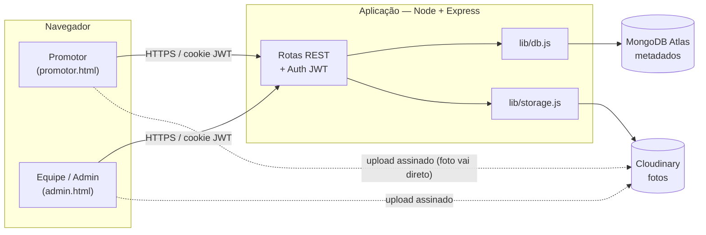

# Memphis PDV — Documentação Técnica

Plataforma interna de **coleta e avaliação de fotos de Ponto de Venda (PDV)**.
Promotores enviam fotos do PDV pelo celular; a equipe revisa, avalia, marca pagamento,
baixa em ZIP organizado por região e exporta para Excel no modelo das planilhas internas.

> Os diagramas estão em **Mermaid** — renderizam direto no GitHub, GitLab, VS Code
> (extensão *Markdown Preview Mermaid*) e no Confluence (macro Mermaid).

## Índice

| Doc | Conteúdo |
|-----|----------|
| [01 — Arquitetura](01-arquitetura.md) | Componentes, stack, topologia, ciclo de uma requisição |
| [02 — Modelo de Dados](02-modelo-de-dados.md) | Coleções MongoDB, diagrama ER, índices |
| [03 — Referência da API](03-api.md) | Todos os 26 endpoints, autenticação, payloads |
| [04 — Fluxos de Negócio (BPMN)](04-fluxos-bpmn.md) | Processo ponta-a-ponta, ciclo de vida da submissão |
| [05 — Diagramas de Sequência (UML)](05-sequencia.md) | Login, upload direto, download ZIP, aprovação |
| [06 — Estrutura de Código (UML)](06-uml-componentes.md) | Diagrama de classes/módulos |
| [07 — Segurança](07-seguranca.md) | JWT, hashing, uploads assinados, entrega autenticada |
| [08 — Deploy & Operação](08-deploy.md) | Plano Vercel, variáveis de ambiente, backup |

## Resumo em 30 segundos



- **Frontend:** HTML + JS puro (sem build) em `public/`.
- **Backend:** Node + Express (`server.js`).
- **Banco:** MongoDB Atlas — só metadados (texto). `lib/db.js` + `lib/mongo.js`.
- **Arquivos:** Cloudinary — as fotos. `lib/storage.js`.
- **Autenticação:** JWT em cookie `httpOnly` (`mp_token`).
- **Hospedagem-alvo:** Vercel (serverless) — ver [08 — Deploy](08-deploy.md).

## Papéis

| Papel | O que faz |
|-------|-----------|
| **Promotor** | Loga, envia até 2 fotos por cliente com os dados do registro, acompanha o status (avaliação / pago). |
| **Admin (equipe)** | Vê e busca todas as fotos, avalia, valida/recusa, marca pago, baixa ZIP e Excel, gerencia listas, aprova/bane promotores e cria outras contas (inclusive admins). |

## Teste de regressão

`test/smoke.js` exercita **25 cenários** ponta-a-ponta (auth, upload no Cloudinary,
avaliação, pago, banir, criar admin, ZIP, Excel, purge).

```bash
# subir o servidor apontando p/ um banco de teste e rodar:
MONGO_DB=memphis_pdv_test node server.js
node test/smoke.js
```
