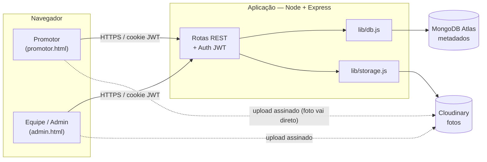

# Memphis PDV — Documentação Técnica

Plataforma interna de **coleta e avaliação de fotos de Ponto de Venda (PDV)**.
Promotores enviam fotos do PDV pelo celular; a equipe revisa, avalia, marca pagamento,
baixa em ZIP organizado por região e exporta para Excel no modelo das planilhas internas.

> Os diagramas estão em **Mermaid** — renderizam direto no GitHub, GitLab, VS Code
> (extensão *Markdown Preview Mermaid*) e no Confluence (macro Mermaid).
>
> Os processos de negócio também existem em **BPMN 2.0 de verdade** em
> [`docs/bpmn/`](bpmn/) (abrem no Camunda Modeler / bpmn.io). **Em divergência,
> o `.bpmn` é o normativo** — o Mermaid é explicativo.

## Índice

| Doc | Conteúdo |
|-----|----------|
| [01 — Arquitetura](01-arquitetura.md) | Componentes, stack, topologia, ciclo de uma requisição |
| [02 — Modelo de Dados](02-modelo-de-dados.md) | Coleções MongoDB, diagrama ER, índices |
| [03 — Referência da API](03-api.md) | Todos os 36 endpoints, autenticação, permissões, payloads |
| [04 — Fluxos de Negócio (BPMN)](04-fluxos-bpmn.md) | Processo ponta-a-ponta, ciclo de vida da submissão |
| [05 — Diagramas de Sequência (UML)](05-sequencia.md) | Login, upload direto, download ZIP, aprovação |
| [06 — Estrutura de Código (UML)](06-uml-componentes.md) | Diagrama de classes/módulos |
| [07 — Segurança](07-seguranca.md) | JWT, hashing, uploads assinados, entrega autenticada |
| [08 — Deploy & Operação](08-deploy.md) | Plano Vercel, variáveis de ambiente, backup |

## Resumo em 30 segundos



- **Frontend:** HTML + JS puro (sem build) em `public/`. O ZIP é montado **no navegador** (JSZip).
- **Backend:** Node + Express (`server.js`).
- **Banco:** MongoDB Atlas — só metadados (texto). `lib/db.js` + `lib/mongo.js`.
- **Arquivos:** Cloudinary — as fotos (upload direto do navegador, entrega assinada). `lib/storage.js`.
- **Autenticação:** JWT em cookie `httpOnly` (`mp_token`) + **permissões granulares** por admin (crachá = acesso total).
- **Hospedagem-alvo:** Discloud (Node persistente); empacote Vercel também pronto — ver [08 — Deploy](08-deploy.md).

## Papéis

| Papel | O que faz |
|-------|-----------|
| **Promotor** | Loga (troca senha provisória no 1º acesso), envia **1 foto/semana e até 4/mês** (cada foto com 1 ou 2 imagens — "antes e depois"), acompanha o status (avaliação / pago). |
| **Admin (equipe)** | Conforme suas **permissões**: `fotos` (busca, avalia, valida/recusa, marca pago, exclui, baixa ZIP e Excel), `aprovar` (promotores e grupos novos), `contas` (cria/edita contas, **importa por planilha**, bane), `listas` (grupos, banco de promotores, senhas da campanha), `aderencia` (números de participação da campanha por período). Acesso total (`*`) só via **crachá**. |

## Teste de regressão

`test/smoke.js` roda ~**129 verificações** ponta-a-ponta (auth, permissões, upload no
Cloudinary, avaliação, pago, banir, criar admin, senha provisória, reset por email,
ZIP, Excel, purge, dados institucionais, aceite e auditoria da LGPD). Há também `test/pentest.js`
(segurança, 45 verificações) e mais três suítes que sobem/limpam o próprio ambiente:
`test/lgpd-portao.js` (portão do aceite, com `LGPD_BLOQUEIA=1`), `test/retencao.js`
(retenção e anonimização, envelhecendo fotos na marra) e `test/reset.js` (o reset
destrutivo, inclusive o abort quando o backup falha). Há também `test/carga.js` (escala).

```bash
node tools/dev-preview.js   # sobe o servidor no banco de TESTE (porta 3000)
node test/smoke.js
```
